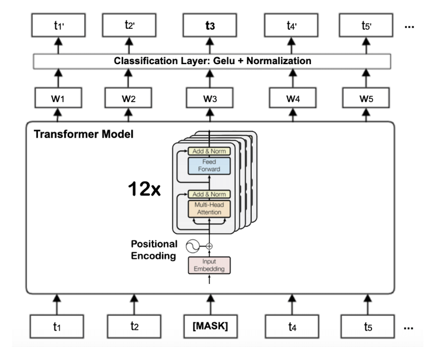

<div style="display: flex; align-items: center;">
  <a href="" style="margin-right: 10px;">
    
  </a>
  <a href="https://www.python.org/" style="margin-right: 10px;">
    
  </a>
  <a href="https://pytorch.org/">
    
  </a>
</div>
<p style="color: var(--text-color); margin-top: 10px;">Estimated Reading Time: 90 min | Author: Jordan Deklerk</p>

<!-- </div>
</header> 
<style>
  .toc {
    padding: 10px;
    border-radius: 5px;
    background-color: var(--toc-background);
  }
</style>
<div class="toc"> -->
  <details>
    <summary accesskey="c" title="(Alt + C)">
      <span class="details">Table of Contents</span>
    </summary>
    <div class="inner">
      <ul>
        <li><a href="#introduction" aria-label="Introduction">Introduction</a>
          <ul>
            <li><a href="#pre-training-techniques" aria-label="Pre-training Techniques">Pre-training Techniques</a></li>
            <li><a href="#problem-formulation" aria-label="Problem Formulation">Problem Formulation</a></li>
            <li><a href="#bert-background" aria-label="BERT Background">BERT Background</a></li>
          </ul>
        </li>
        <li><a href="#cms-synthetic-data" aria-label="CMS Synthetic Data">CMS Synthetic Data</a></li>
        <li><a href="#data-preprocessing" aria-label="Data Preprocessing">Data Preprocessing</a></li>
        <li><a href="#creating-the-ehr-dataset" aria-label="Creating the EHR Dataset">Creating the EHR Dataset</a></li>
        <li><a href="#ehr-bert-model" aria-label="Building the BERT Model">Building the BERT Model</a>
          <ul>
            <li><a href="#bert-architecture" aria-label="BERT Architecture">BERT Architecture</a></li>
            <li><a href="#activation-function-and-layer-norm" aria-label="Activation Function and Layer Norm">Activation Function and Layer Norm</a></li>
            <li><a href="#multi-head-attention-mechanism" aria-label="Multi-Head Attention Mechanism<">Multi-Head Attention Mechanism</a></li>
            <li><a href="#sublayer-connection" aria-label="Sublayer Connection">Sublayer Connection</a></li>
            <li><a href="#position-wise-feed-forward" aria-label="Position Wise Feedforward">Position Wise Feedforward</a></li>
            <li><a href="#transformer-block" aria-label="Transformer Block">Transformer Block</a></li>
            <li><a href="#embeddings" aria-label="Embeddings">Embeddings</a></li>
            <li><a href="#pre-train-model-wrapper" aria-label="Pre-train Model Wrapper">Pre-train Model Wrapper</a></li>
            <li><a href="#bert-pooler" aria-label="BERT Pooler">BERT Pooler</a></li>
            <li><a href="#bert-model" aria-label="BERT Model">BERT Model</a></li>
          </ul>
        </li>
        <li><a href="#ehr-bert-model" aria-label="EHR BERT Model">EHR BERT Model</a></li>
        <li><a href="#training-the-model" aria-label="Training the Model">Training the Model</a></li>
        <li><a href="#results" aria-label="Results">Results</a></li>
        <li><a href="#conclusion" aria-label="Conclusion">Conclusion</a></li>
      </ul>
    </div>
  </details>
<!-- </div> -->

## Introduction <a id="introduction" style="padding-top: 70px; margin-top: -70px; display: block;"></a>

Given the promising potential of Electronic Health Records (EHR), extracting interpretable predictive patterns from EHR data holds significant value in healthcare and has garnered considerable attention in recent years. EHR data are inherently complex, typically comprising sequences of patients' admission records, such as diagnoses, clinical notes, and medications. Analyzing EHR data effectively is crucial for both medical professionals and patients, as it can offer preventive health alerts and personalized care plans.

Various predictive models utilizing deep learning technology have been proposed for predicting temporal events, including diagnosis prediction, mortality prediction, risk prediction, and medication recommendation. A common supervised training method for using EHR data in temporal event prediction involves treating previous records as features and subsequent admission records as labels. However, this approach inherently overlooks patients' final admissions due to the absence of labels. Additionally, learning effective representations for medical concepts by leveraging domain knowledge remains a challenging issue in healthcare applications. So there are still challenges in developing predictive models that use the temporal information of EHR data effectively.

<br>
<figure>
  
  <figcaption style="margin-top: 10px; color: gray;">
    <a href="https://proceedings.mlr.press/v158/pang21a/pang21a.pdf" target="_blank" style="color: gray; text-decoration: none;">Figure 1</a>: Overview of BERT architecture on structured EHR data. To distinguish visit boundaries, visit segment embeddings are added to concept embeddings. Next, both visit embeddings and concept embeddings go through a temporal transformation, where concept, age, and time embeddings are concatenated together. The concatenated embeddings are then fed into a fully connected layer. This temporal concept embedding becomes the input to BERT. We used the BERT learning objective Masked Language Model as the primary learning objective and introduced an EHR-specific secondary learning objective visit type prediction.
  </figcaption>
</figure>
<br>

### Pre-training Techniques <a id="pre-training-techniques" style="padding-top: 70px; margin-top: -70px; display: block;"></a>

One approach to overcome some of these challenges is the application of pre-training techniques, which have proven highly successful in various domains such as image classification and machine translation. These techniques offer a robust foundation for models, enhancing their ability to generalize from the training data and thereby improving their performance. In the following section, we will delve into the specifics of pre-training techniques, particularly focusing on the adaptation of the BERT framework for EHR data, which has shown significant potential in addressing the challenges previously mentioned.

The unsupervised nature of pre-training can be thought of as a form of regularization that helps models generalize better from the training data. In recent years, there have been significant advancements in language model pre-training techniques. These techniques have led to substantial improvements in performance across a range of natural language processing (NLP) tasks. Among these pre-training techniques, BERT (Devlin et al., 2018) has emerged as the most widely used. BERT is built on the Transformer architecture (Vaswani et al., 2017) and employs a masked language model to achieve bi-directional representation.

In this project, we leverage the power of BERT by adapting its framework to pre-train our model on each visit of the EHR data. This approach allows us to make use of single-visit data that other "bag-of-features" models have historically struggled to incorporate effectively.

### Problem Formulation <a id="problem-formulation" style="padding-top: 70px; margin-top: -70px; display: block;"></a>

In longitudinal EHR data, each patient can be represented as a sequence of multivariate observations

$$
\mathcal{X}^{(n)}= \left\{\mathcal{X}_1^{(n)}, \mathcal{X}_2^{(n)}, \cdots, \mathcal{X}_{T^{(n)}}^{(n)} \right\},
$$

where $n \in\{1,2, \ldots, N\}$, and $N$ is the total number of patients. Note that $T^{(n)}$ denotes the number of visits for the $n^{\text {th }}$ patient. For each visit $\mathcal{X}_t$, we select two main types of medical codes to represent it: $\mathcal{X}_t=\mathcal{C}_d^t \cup \mathcal{C}_p^t$, which is a union set of the corresponding diagnosis codes $\mathcal{C}_d^t \subset \mathcal{C}_d$ and the procedure codes $\mathcal{C}_p^t \subset \mathcal{C}_p$. For simplicity, we use $\mathcal{C}_*^t$ to denote the unified definition for different types of medical codes and omit the superscript $(n)$ for a single patient when it is clear. Note that $\mathcal{C}_*$ represents the medical code set, and $\left|\mathcal{C}_*\right|$ is the size of the code set and $c_* \in \mathcal{C}_*$ is the medical code.

**Problem Definition (Diagnosis and Procedure Prediction)**

Given the diagnosis codes $\mathcal{C}_d^t$ and procedure codes $\mathcal{C}_p^t$ of the visit at time $t$, and the patient history $\mathcal{X}_{1: t}=\left\{\mathcal{X}_1, \mathcal{X}_2, \cdots, \mathcal{X}_{t-1}\right\}$, we aim to predict multiple diagnoses and procedures by generating a multi-label output $\hat{\boldsymbol{y}}_t \in\{0,1\}^{\left|\mathcal{C}_d\right|} \cup \{0,1\}^{\left|\mathcal{C}_p\right|}$.

### BERT Background <a id="bert-background" style="padding-top: 70px; margin-top: -70px; display: block;"></a>

BERT, built on a multi-layer Transformer encoder as described by [Vaswani et al. (2017)](https://arxiv.org/pdf/1706.03762), leverages two key unsupervised pre-training tasks:

1. **Masked Language Model**: Unlike traditional models that predict the next word based on previous words, BERT randomly masks certain words in a sentence and predicts their original vocabulary IDs using context from both directions.
2. **Next Sentence Prediction**: Since many of BERT's applications involve understanding the relationship between two sentences, it is pre-trained with a binary task to determine if one sentence follows another.

<br>
<figure style="text-align: center;">
  
  <figcaption style="margin-top: 10px; color: gray;">Figure 2: The standard BERT encoder-only architecture</figcaption>
</figure>
<br><br>

A typical input example to BERT looks like this:

```
Input = [CLS] the man went to [MASK] store [SEP] he bought a gallon [MASK] milk [SEP]
Label = IsNext
```

In this example:

- `[CLS]` is a special token placed at the beginning of the input to serve as a classification token. The final state of this token is used for classification tasks.
- `[SEP]` is a separator token used to distinguish between two sentences.
- `[MASK]` represents the masked words that the model tries to predict in the masked language model task.

**Adapting BERT to EHR Data**

Masked token learning, inspired by BERT, can be adapted for electronic health records to predict diagnoses and procedures by leveraging the contextual relationships within medical data. To implement this, patient records are converted into sequences where each token represents a medical event, such as a diagnosis or procedure. During training, some tokens are randomly selected and replaced with a special `[MASK]` token. The model is trained to predict the original medical events corresponding to these `[MASK]` tokens by utilizing the context provided by the surrounding tokens.

For example, if a patient's EHR sequence is `I10, I25, E11, Z01`, representing the diagnosis codes for <span style="color: #FF4500;">hypertension</span>, <span style="color: #FF4500;">heart disease</span>, <span style="color: #FF4500;">diabetes</span>, and <span style="color: #FF4500;">encounter for examination</span>, the sequence might be modified to `I10, [MASK], E11, Z01` during training. The model would then learn to predict that the masked token should be "I25" (<span style="color: #FF4500;">heart disease</span>), based on the context of the other codes. This method allows the model to understand the relationships and dependencies between different medical events, enhancing its ability to predict missing or future diagnoses and procedures.

## CMS Synthetic Data <a id="cms-synthetic-data" style="padding-top: 70px; margin-top: -70px; display: block;"></a>

Medicare Claims Synthetic Public Use Files (SynPUFs) provide a way to work with realistic Medicare claims data while protecting beneficiary privacy. The SynPUFs are similar in structure to CMS Limited Data Sets but with fewer variables, allowing users to develop programs and products that will work on actual CMS data files. These synthetic files include a robust set of metadata not available in the public domain.

Though limited in inferential research value, SynPUFs offer a timely and cost-effective way to access realistic data, fostering innovation and better care for Medicare beneficiaries. In this project, we use the 2008-2010 Data Entrepreneurs’ SynPUF, available to download for free.

I also provide a script to pull this data from the CMS website and preprocess it on my [GitHub](https://github.com/jordandeklerk/EHR-BERT/tree/main) for this project. Simply run

```bash
bash download_data.sh
```

and the directory will be made for you with the entire CMS sample.

**Data Statistics**

<table style="width:100%; text-align:center;">
  <thead>
    <tr>
      <th colspan="5" style="text-align:center;"><strong>Table 1: Summary of the Characteristics of the CMS Linkable 2008–2010 Medicare DE-SynPUF</strong></th>
    </tr>
    <tr>
      <th>DE-SynPUF</th>
      <th>Unit of Record</th>
      <th>Number of Records 2008</th>
      <th>Number of Records 2009</th>
      <th>Number of Records 2010</th>
    </tr>
  </thead>
  <tbody>
    <tr>
      <td>Beneficiary Summary DE-SynPUF</td>
      <td>Beneficiary</td>
      <td>2,326,856</td>
      <td>2,291,320</td>
      <td>2,255,098</td>
    </tr>
    <tr>
      <td>Inpatient Claims DE-SynPUF<sup>*</sup></td>
      <td>Claim</td>
      <td>547,800</td>
      <td>504,941</td>
      <td>280,081</td>
    </tr>
    <tr>
      <td>Outpatient Claims DE-SynPUF<sup>*</sup></td>
      <td>Claim</td>
      <td>5,673,808</td>
      <td>6,519,340</td>
      <td>3,633,839</td>
    </tr>
    <tr>
      <td>Carrier Claims DE-SynPUF<sup>*</sup></td>
      <td>Claim</td>
      <td>34,276,324</td>
      <td>37,304,993</td>
      <td>23,282,135</td>
    </tr>
    <tr>
      <td>Prescription Drug Events (PDE) DE-SynPUF<sup>*</sup></td>
      <td>Claim</td>
      <td>39,927,827</td>
      <td>43,379,293</td>
      <td>27,778,849</td>
    </tr>
  </tbody>
</table>

## Data Preprocessing <a id="data-preprocessing" style="padding-top: 70px; margin-top: -70px; display: block;"></a>

We need to preprocess the data to extract diagnosis and procedure codes to create vocabularies for the BERT model to use. Below we have the code for the `ClaimsProcessor` class which performs essential preprocessing to transform raw medical claims data into a structured format suitable for model training and inference. Keep in mind for our project, we are only interested in the inpatient claims in the CMS dataset.

The process involves loading claims data, converting procedure codes to string format, calculating inpatient readmissions within 30 days, and creating new features such as `IP_READMIT_30DAYS`. It counts unique patients and their claims, filters patients with three or more visits, and extracts ICD diagnosis and procedure codes into lists, ensuring each code is treated as a separate token. Unique ICD and procedure codes are saved into vocabularies for tokenization, which is crucial for converting the data into token IDs for the EHR-BERT model.

We will start with some installations.

<details>
    <summary>Install Code</summary>

```python
%%capture
!pip install -q wandb einops
```

</details>
<br>

Assuming you have downloaded the CMS data already using the `download_data.sh` script in the [repo](https://github.com/jordandeklerk/EHR-BERT/tree/main) for this project (which is highly recommended), we now need to combine and process the csv files into a single sample. We can do this with the code below. (Keep in mind, I highly suggest you go to the repo and grab the script to fetch the data and combine the claims).

<details>
    <summary>Fetching Data Code</summary>

```python
import numpy as np
import pandas as pd
import pickle as pl
import os
import glob
from concurrent.futures import ThreadPoolExecutor
import time

def reduce_mem_usage(df):
    """ Iterate through all the columns of a dataframe and modify the data type
        to reduce memory usage.
    """
    start_mem = df.memory_usage().sum() / 1024**2

    for col in df.columns:
        col_type = df[col].dtype

        if col_type != object:
            c_min = df[col].min()
            c_max = df[col].max()
            if str(col_type)[:3] == 'int':
                if c_min > np.iinfo(np.int8).min and c_max < np.iinfo(np.int8).max:
                    df[col] = df[col].astype(np.int8)
                elif c_min > np.iinfo(np.int16).min and c_max < np.iinfo(np.int16).max:
                    df[col] = df[col].astype(np.int16)
                elif c_min > np.iinfo(np.int32).min and c_max < np.iinfo(np.int32).max:
                    df[col] = df[col].astype(np.int32)
                elif c_min > np.iinfo(np.int64).min and c_max < np.iinfo(np.int64).max:
                    df[col] = df[col].astype(np.int64)
            else:
                if c_min > np.finfo(np.float16).min and c_max < np.finfo(np.float16).max:
                    df[col] = df[col].astype(np.float16)
                elif c_min > np.finfo(np.float32).min and c_max < np.finfo(np.float32).max:
                    df[col] = df[col].astype(np.float32)
                else:
                    df[col] = df[col].astype(np.float64)
        else:
            df[col] = df[col].astype('category')

    end_mem = df.memory_usage().sum() / 1024**2

    return df

def read_csv_in_chunks(file_path, chunksize=10000):
    print(f"Reading file in chunks: {file_path}")
    chunks = []
    for chunk in pd.read_csv(file_path, chunksize=chunksize):
        chunks.append(chunk)
    combined_df = pd.concat(chunks, ignore_index=True)
    return reduce_mem_usage(combined_df)

def concatenate_claims(directories):
    combined_ip_claims = pd.DataFrame()

    patterns = {
        "Inpatient_Claims": "*Inpatient_Claims*.csv",
    }

    with ThreadPoolExecutor() as executor:
        future_to_df = {}
        for claim_type, pattern in patterns.items():
            for directory in directories:
                for file_path in glob.glob(os.path.join(directory, pattern)):
                    future = executor.submit(read_csv_in_chunks, file_path)
                    future_to_df[future] = claim_type

        for future in future_to_df:
            result = future.result()
            if future_to_df[future] == "Inpatient_Claims":
                combined_ip_claims = pd.concat([combined_ip_claims, result], ignore_index=True)

    return combined_ip_claims
```

</details>
<br>

Now we can process the combined inpatient claims file to extract the relevant diagnosis and procedure codes, and format the data into a suitable structure for our model.

<details>
    <summary>Claims Preprocessing Code</summary>

```python
import pandas as pd
import os
import time

class ClaimsProcessor:
    def __init__(self, claims_file):
        start_time = time.time()
        print("Loading claims data...")
        self.claims = pd.read_pickle(claims_file)
        self.claims['ICD9_PRCDR_CD_1'] = self.claims['ICD9_PRCDR_CD_1'].apply(lambda x: str(int(x)) if pd.notnull(x) else x)
        print(f"Loaded claims data in {time.time() - start_time:.2f} seconds.")
        print('-'*50)

    @staticmethod
    def calculate_ip_readmissions(df):
        df['CLM_ADMSN_DT'] = pd.to_datetime(df['CLM_ADMSN_DT'], format='%Y%m%d', errors='coerce')
        df['NCH_BENE_DSCHRG_DT'] = pd.to_datetime(df['NCH_BENE_DSCHRG_DT'], format='%Y%m%d', errors='coerce')

        df.sort_values(by=['DESYNPUF_ID', 'CLM_ADMSN_DT'], inplace=True)

        df['PREV_DSCHRG_DT'] = df.groupby('DESYNPUF_ID')['NCH_BENE_DSCHRG_DT'].shift(1)
        df['DAYS_SINCE_LAST_DISCHARGE'] = (df['CLM_ADMSN_DT'] - df['PREV_DSCHRG_DT']).dt.days

        df['IP_READMIT_30DAYS'] = df['DAYS_SINCE_LAST_DISCHARGE'].apply(lambda x: 1 if x <= 30 else 0)

        return df

    def preprocess(self):
        start_time = time.time()
        print("Calculating inpatient readmissions...")
        self.claims = self.calculate_ip_readmissions(self.claims)
        print(f"Calculated inpatient readmissions in {time.time() - start_time:.2f} seconds.")
        print('-'*50)

        start_time = time.time()
        print("Counting unique patients...")
        self.unique_patients = self.claims['DESYNPUF_ID'].nunique()
        print(f"Counted unique patients in {time.time() - start_time:.2f} seconds.")
        print('-'*50)

        start_time = time.time()
        print("Counting unique claims per patient...")
        unique_claims_counts = self.claims.groupby('DESYNPUF_ID')['CLM_ID'].nunique()
        print(f"Counted unique claims per patient in {time.time() - start_time:.2f} seconds.")
        print('-'*50)

        start_time = time.time()
        print("Filtering patients with 3 or more visits...")
        patients_with_3_or_more_visits = unique_claims_counts[unique_claims_counts >= 3].index
        self.total_patients = len(patients_with_3_or_more_visits)
        self.filtered_claims = self.claims[self.claims['DESYNPUF_ID'].isin(patients_with_3_or_more_visits)]
        print(f"Filtered patients with 3 or more visits in {time.time() - start_time:.2f} seconds.")
        print('-'*50)

        start_time = time.time()
        print("Counting readmissions...")
        readmission_counts = self.filtered_claims.groupby('DESYNPUF_ID')['IP_READMIT_30DAYS'].sum()
        self.patients_with_readmissions = readmission_counts[readmission_counts > 0]
        self.number_of_patients_with_readmissions = len(self.patients_with_readmissions)
        self.patients_without_readmissions = readmission_counts[readmission_counts == 0]
        self.number_of_patients_with_no_readmissions = len(self.patients_without_readmissions)
        print(f"Counted readmissions in {time.time() - start_time:.2f} seconds.")
        print('-'*50)

    def report(self):
        print("Generating report...")
        print("Number of patients with 3 or more visits and at least one 30 day re-admission:", self.number_of_patients_with_readmissions)
        print("Number of patients with 3 or more visits and no 30 day re-admission:", self.number_of_patients_with_no_readmissions)
        print(f'Total number of patients with 3 or more visits: {self.total_patients} out of {self.unique_patients} total patients ({100 * self.total_patients / self.unique_patients:.0f}%)')
        print('-'*50)

    def get_codes(self):
        start_time = time.time()
        print("Extracting codes...")
        data = self.filtered_claims.copy()

        columns = ['DESYNPUF_ID', 'CLM_ID', 'ADMTNG_ICD9_DGNS_CD', 'ICD9_DGNS_CD_1', 'ICD9_DGNS_CD_2', 'ICD9_DGNS_CD_3',
                  'ICD9_DGNS_CD_4', 'ICD9_DGNS_CD_5', 'ICD9_DGNS_CD_6', 'ICD9_DGNS_CD_7', 'ICD9_DGNS_CD_8', 'ICD9_DGNS_CD_9', 'ICD9_DGNS_CD_10',
                  'CLM_DRG_CD', 'IP_READMIT_30DAYS', 'ICD9_PRCDR_CD_1', 'ICD9_PRCDR_CD_2', 'ICD9_PRCDR_CD_3', 'ICD9_PRCDR_CD_4']
        subset_data = data[columns]

        # Collecting all ICD9 codes into a single column array for each row
        subset_data['ALL_ICD9_CODES'] = subset_data[['ICD9_DGNS_CD_1']].values.tolist()

        # Exploding the list into rows, dropping NaNs, and dropping duplicates per patient
        subset_data = subset_data.explode('ALL_ICD9_CODES').dropna(subset=['ALL_ICD9_CODES']).drop_duplicates(subset=['DESYNPUF_ID', 'CLM_ID', 'ALL_ICD9_CODES'])

        # Grouping by DESYNPUF_ID and CLM_ID and collecting unique ICD9 codes as a list
        icd9_codes = subset_data.groupby(by=['DESYNPUF_ID', 'CLM_ID'])['ALL_ICD9_CODES'].apply(lambda x: list(x.unique())).reset_index()
        icd9_codes = icd9_codes.rename(columns={'ALL_ICD9_CODES': 'ICD9_CODE'})

        # Continue with PROC Codes in the same manner
        subset_data['ALL_PROC_CODES'] = subset_data[['ICD9_PRCDR_CD_1']].values.tolist()
        subset_data = subset_data.explode('ALL_PROC_CODES').dropna(subset=['ALL_PROC_CODES']).drop_duplicates(subset=['DESYNPUF_ID', 'CLM_ID', 'ALL_PROC_CODES'])

        # Grouping by DESYNPUF_ID and CLM_ID and collecting unique PROC codes as a list
        proc_codes = subset_data.groupby(by=['DESYNPUF_ID', 'CLM_ID'])['ALL_PROC_CODES'].apply(lambda x: list(x.unique())).reset_index()
        proc_codes = proc_codes.rename(columns={'ALL_PROC_CODES': 'ICD9_PROC_CODES'})

        # Merging all results
        result = pd.merge(icd9_codes, proc_codes, on=['DESYNPUF_ID', 'CLM_ID'], how='inner')
        result = result.rename(columns={'DESYNPUF_ID': 'SUBJECT_ID', 'CLM_ID': 'HADM_ID'})

        # Add the IP_READMIT_30DAYS label
        readmit_labels = subset_data[['DESYNPUF_ID', 'CLM_ID', 'IP_READMIT_30DAYS']].drop_duplicates(subset=['DESYNPUF_ID', 'CLM_ID'])
        result = pd.merge(result, readmit_labels, left_on=['SUBJECT_ID', 'HADM_ID'], right_on=['DESYNPUF_ID', 'CLM_ID']).drop(columns=['DESYNPUF_ID', 'CLM_ID'])

        print(f"Extracted codes in {time.time() - start_time:.2f} seconds.")
        print('-'*50)
        return result, icd9_codes, proc_codes

    def save_unique_codes(self, icd9_codes, proc_codes, output_dir='./pretrain'):
        start_time = time.time()
        print("Saving unique ICD and PROC codes...")

        # Ensure the output directory exists
        os.makedirs(output_dir, exist_ok=True)

        # Get all unique ICD codes, converting each to string and filtering out NaN values
        unique_icd_codes = set()
        for codes in icd9_codes['ICD9_CODE']:
            for code in codes:
                if pd.notna(code):
                    unique_icd_codes.add(str(code))

        # Save unique ICD codes to dx-vocab.txt file
        with open('./pretrain/dx-vocab.txt', 'w') as file:
            file.write('\n'.join(unique_icd_codes))

        print('Created a vocab with {} unique ICD codes.'.format(len(unique_icd_codes)))

        # Get all unique PROC codes, converting each to string and filtering out NaN values
        unique_proc_codes = set()
        for codes in proc_codes['ICD9_PROC_CODES']:
            for code in codes:
                if pd.notna(code):
                    unique_proc_codes.add(str(code))

        # Save unique PROC codes to proc-vocab.txt file
        with open('./pretrain/proc-vocab.txt', 'w') as file:
            file.write('\n'.join(unique_proc_codes))

        print('Created a vocab with {} unique PROC codes.'.format(len(unique_proc_codes)))
        print(f"Saved unique codes in {time.time() - start_time:.2f} seconds.")
        print('-'*50)

if __name__ == "__main__":
    processor = ClaimsProcessor('combined_ip_claims.pkl')
    processor.preprocess()
    processor.report()
    result, icd9_codes, proc_codes = processor.get_codes()
    processor.save_unique_codes(icd9_codes, proc_codes)
    print(result.head())

result.to_pickle('./pretrain/data-comb-visit.pkl')
```

</details>
<br>

<!-- ```
Output:

Loading claims data...
Loaded claims data in 3.10 seconds.
--------------------------------------------------
Calculating inpatient readmissions...
Calculated inpatient readmissions in 4.81 seconds.
--------------------------------------------------
Counting unique patients...
Counted unique patients in 0.24 seconds.
--------------------------------------------------
Counting unique claims per patient...
Counted unique claims per patient in 0.76 seconds.
--------------------------------------------------
Filtering patients with 3 or more visits...
Filtered patients with 3 or more visits in 0.56 seconds.
--------------------------------------------------
Counting readmissions...
Counted readmissions in 0.16 seconds.
--------------------------------------------------
Generating report...
Number of patients with 3 or more visits and at least one 30 day re-admission: 76480
Number of patients with 3 or more visits and no 30 day re-admission: 62345
Total number of patients with 3 or more visits: 138825 out of 755214 total patients (18%)
--------------------------------------------------
Extracting codes...
Extracted codes in 53.82 seconds.
--------------------------------------------------
Saving unique ICD and PROC codes...
Created a vocab with 4457 unique ICD codes.
Created a vocab with 1119 unique PROC codes.
Saved unique codes in 0.83 seconds.
--------------------------------------------------
         SUBJECT_ID          HADM_ID ICD9_CODE ICD9_PROC_CODES  \
0  00000B48BCF4AD29   45461150060934    [4241]          [3520]
1  00000B48BCF4AD29   45731150068478    [3970]          [3616]
2  00009C897C3D8372   45111150044486   [44023]          [8880]
3  0001448457F2ED81  241181127013424   [29590]          [9424]
4  0001448457F2ED81  241331127045248   [82021]          [7936]

   IP_READMIT_30DAYS
0                  0
1                  1
2                  0
3                  0
4                  0
``` -->

Our final dataframe for the model is structured at the claim level, focusing solely on the primary diagnosis and procedure code for each claim. Although incorporating multiple diagnosis and procedure codes per claim is feasible, it would significantly increase the complexity of our masked token learning prediction task. Additionally, it's uncertain whether these additional codes provide valuable insights beyond what the primary codes offer.

## Creating the EHR Dataset <a id="creating-the-ehr-dataset" style="padding-top: 70px; margin-top: -70px; display: block;"></a>

We need to create a dataset for EHR data with masked tokens suitable for training a BERT-style model. This involves defining a vocabulary for diagnosis and procedure codes, tokenizing the data, and randomly masking some tokens to create a masked language model task. Then we need to split the dataset into training, evaluation, and test sets. The EHR data is transformed to include `[PAD]` and `[CLS]` tokens and randomly masked tokens to mimic the input required for BERT. The final dataset consists of tokenized sequences and corresponding labels for diagnosis and procedure codes.

The following code accomplishes each of these tasks.

```python
from __future__ import absolute_import
from __future__ import division
from __future__ import print_function

import os
import logging
import random
import copy
from sklearn.model_selection import train_test_split

import numpy as np
import pandas as pd
import torch
from torch.utils.data import DataLoader, RandomSampler, SequentialSampler, Dataset


logging.basicConfig(format='%(asctime)s - %(levelname)s - %(name)s -   %(message)s',
                    datefmt='%m/%d/%Y %H:%M:%S',
                    level=logging.INFO)
logger = logging.getLogger(__name__)


class Voc(object):
    def __init__(self):
        self.idx2word = {}
        self.word2idx = {}

    def add_sentence(self, sentence):
        for word in sentence:
            if word not in self.word2idx:
                self.idx2word[len(self.word2idx)] = word
                self.word2idx[word] = len(self.word2idx)


def random_word(tokens, vocab):
    for i, _ in enumerate(tokens):
        prob = random.random()
        # mask token with 15% probability
        if prob < 0.15:
            prob /= 0.15

            # 80% randomly change token to mask token
            if prob < 0.8:
                tokens[i] = "[MASK]"
            # 10% randomly change token to random token
            elif prob < 0.9:
                tokens[i] = random.choice(list(vocab.word2idx.items()))[0]
            else:
                pass
        else:
            pass

    return tokens


class EHRTokenizer(object):
    """Runs end-to-end tokenization"""

    def __init__(self, data_dir, special_tokens=("[PAD]", "[CLS]", "[MASK]")):

        self.vocab = Voc()

        # special tokens
        self.vocab.add_sentence(special_tokens)

        self.proc_voc = self.add_vocab(os.path.join('./pretrain', 'proc-vocab.txt'))
        self.dx_voc = self.add_vocab(os.path.join('./pretrain', 'dx-vocab.txt'))

    def add_vocab(self, vocab_file):
        voc = self.vocab
        specific_voc = Voc()
        with open(vocab_file, 'r') as fin:
            for code in fin:
                voc.add_sentence([code.rstrip('\n')])
                specific_voc.add_sentence([code.rstrip('\n')])
        return specific_voc

    def convert_tokens_to_ids(self, tokens):
        """Converts a sequence of tokens into ids using the vocab."""
        ids = []
        for token in tokens:
            ids.append(self.vocab.word2idx[token])
        return ids

    def convert_ids_to_tokens(self, ids):
        """Converts a sequence of ids in wordpiece tokens using the vocab."""
        tokens = []
        for i in ids:
            tokens.append(self.vocab.idx2word[i])
        return tokens


class EHRDataset(Dataset):
    def __init__(self, data_pd, tokenizer: EHRTokenizer, max_seq_len):
        self.data_pd = data_pd
        self.tokenizer = tokenizer
        self.seq_len = max_seq_len

        self.sample_counter = 0

        def transform_data(data):
            """
            :param data: raw data form
            :return: {subject_id, [adm, 2, codes]},
            """
            admissions = []
            for _, row in data.iterrows():
                admission = [list(row['ICD9_CODE']), list(row['ICD9_PROC_CODES'])]
                admissions.append(admission)
            return admissions

        self.admissions = transform_data(data_pd)

    def __len__(self):
        return len(self.admissions)

    def __getitem__(self, item):
        cur_id = item
        adm = copy.deepcopy(self.admissions[item])

        def fill_to_max(l, seq):
            while len(l) < seq:
                l.append('[PAD]')
            return l

        y_dx = np.zeros(len(self.tokenizer.dx_voc.word2idx))
        y_proc = np.zeros(len(self.tokenizer.proc_voc.word2idx))

        # Handle diagnosis codes
        for item in adm[0]:
            if item in self.tokenizer.dx_voc.word2idx:
                y_dx[self.tokenizer.dx_voc.word2idx[item]] = 1
            else:
                print(f"Warning: Diagnosis token {item} not found in dx_voc.")
        for item in adm[1]:
            if item in self.tokenizer.proc_voc.word2idx:
                y_proc[self.tokenizer.proc_voc.word2idx[item]] = 1
            else:
                print(f"Warning: Token {item} not found in proc_voc.")

        # replace tokens with [MASK]
        adm[0] = random_word(adm[0], self.tokenizer.proc_voc)
        adm[1] = random_word(adm[1], self.tokenizer.dx_voc)

        # extract input and output tokens
        input_tokens = []  # (2*max_len)
        input_tokens.extend(
            ['[CLS]'] + fill_to_max(list(adm[0]), self.seq_len - 1))
        input_tokens.extend(
            ['[CLS]'] + fill_to_max(list(adm[1]), self.seq_len - 1))

        # convert tokens to ids
        input_ids = self.tokenizer.convert_tokens_to_ids(input_tokens)

        if cur_id < 5:
            logger.info("*** Example ***")
            logger.info("input tokens: %s" % " ".join(
                [str(x) for x in input_tokens]))
            logger.info("input_ids: %s" %
                        " ".join([str(x) for x in input_ids]))

        cur_tensors = (torch.tensor(input_ids, dtype=torch.long).view(-1, self.seq_len),
                       torch.tensor(y_dx, dtype=torch.float),
                       torch.tensor(y_proc, dtype=torch.float))

        return cur_tensors


def load_dataset(data):
    data_dir = './pretrain'
    max_seq_len = 55

    # load tokenizer
    tokenizer = EHRTokenizer(data_dir)

    # load data
    data = pd.read_pickle(os.path.join(data_dir, 'data-comb-visit.pkl'))

    # load trian, eval, test data
    ids_file = [os.path.join(data_dir, 'train-id.txt'),
                os.path.join(data_dir, 'eval-id.txt'),
                os.path.join(data_dir, 'test-id.txt')]

    def load_ids(data, file_name):
        ids = []
        with open(file_name, 'r') as f:
            for line in f:
                ids.append(line.rstrip('\n'))
        # print("Loaded IDs from", file_name, ":", ids)
        filtered_data = data[data['SUBJECT_ID'].isin(ids)].reset_index(drop=True)
        print("Filtered data shape:", filtered_data.shape)
        return filtered_data

    train_dataset, eval_dataset, test_dataset = tuple(map(lambda x: EHRDataset(load_ids(data, x), tokenizer, max_seq_len), ids_file))

    return tokenizer, train_dataset, eval_dataset, test_dataset
```

There is a lot going on in this code so let's try to understand this from an intuitive perspectice and provide an example of what kinds of input sequences we are going to feed into our model from this dataset.

**Intuition**

Creating this dataset with masked tokens is essential for training a BERT-style model on EHR data. The model learns to predict the masked tokens, thereby understanding the context and relationships between different medical codes in patient records. This approach allows the model to capture complex patterns in the data, improving its performance on downstream tasks such as diagnosis prediction, readmission prediction, and other clinical outcomes.

**Example Dataset Input for a BERT-style Model**

Suppose we have a claim with the following ICD codes: `4019`, `25000`, and procedure codes: `9904`. Here’s an example of how the dataset might look after preprocessing for input into a BERT-style model:

#### Input Tokens

```
['[CLS]', '4019', '25000', '[MASK]', '[PAD]', '[PAD]', '[PAD]', '[CLS]', '9904', '[MASK]', '[PAD]', '[PAD]', '[PAD]']
```

#### Input IDs

```
[0, 1, 2, 3, 4, 4, 4, 0, 5, 3, 4, 4, 4]
```

In this example:

- `[CLS]` is the classification token added at the beginning of each sequence.
- `[PAD]` tokens are used to pad the sequences to a fixed length.
- `[MASK]` tokens are randomly introduced to create the masked language model task.

The input IDs are numerical representations of these tokens, which the BERT model uses for training. The model's objective is to predict the original tokens for the masked positions, enabling it to learn the relationships and context within the medical codes.

After we create the dataset, we need to split it into training, evaluation, and testing sets.

```python
from sklearn.model_selection import train_test_split

def split_dataset(data_path):
    """
    Splits the dataset into training, evaluation, and testing datasets using train_test_split.
    Writes the IDs for each split into separate files.

    Parameters:
    - data_path (str): The path to the pickle file containing the DataFrame.

    Outputs:
    - Files containing the IDs for the train, eval, and test datasets.
    """
    np.random.seed(315)  # Setting seed for reproducibility

    data = pd.read_pickle(data_path)
    sample_id = data['SUBJECT_ID'].unique()

    # Splitting the data into train (67%) and temp (33%)
    train_id, temp_id = train_test_split(sample_id, test_size=1/3, random_state=315)

    # Splitting the temp into eval (50% of temp, 16.5% of total) and test (50% of temp, 16.5% of total)
    eval_id, test_id = train_test_split(temp_id, test_size=0.5, random_state=315)

    def ids_to_file(ids, file_name):
        with open(file_name, 'w') as fout:
            for item in ids:
                fout.write(str(item) + '\n')

    ids_to_file(train_id, './pretrain/train-id.txt')
    ids_to_file(eval_id, './pretrain/eval-id.txt')
    ids_to_file(test_id, './pretrain/test-id.txt')

    print(f'train size: {len(train_id)}, eval size: {len(eval_id)}, test size: {len(test_id)}')

path = './pretrain/data-comb-visit.pkl'
split_dataset(path)

print("Loading Dataset...")
tokenizer, train_dataset, eval_dataset, test_dataset = load_dataset(path)
train_dataloader = DataLoader(train_dataset,
                                  sampler=RandomSampler(train_dataset),
                                  batch_size=64)
eval_dataloader = DataLoader(eval_dataset,
                                 sampler=SequentialSampler(eval_dataset),
                                 batch_size=64)
test_dataloader = DataLoader(test_dataset,
                                 sampler=SequentialSampler(test_dataset),
                                 batch_size=64)
```

In our project, we have that train size: `85,686`, eval size: `21,421`, and test size: `21,422`.

We can also investigate what a batch from the train loader looks like below.

```python
# Inspect one element from the train data loader
train_batch = next(iter(train_dataloader))
print("Train batch:")
print("Input IDs shape:", train_batch[0].shape)
print("Output DX labels shape:", train_batch[1].shape)
print("Output PROC labels shape:", train_batch[2].shape)
print()
```

```
Output:

Train batch:
Input IDs shape: torch.Size([64, 2, 55])
Output DX labels shape: torch.Size([64, 4457])
Output PROC labels shape: torch.Size([64, 1119])
```

Keep in mind that the batch size we are using is 64 and that we have a maximum sequence length of 55.

We need to define some utility functions to help us calculate our evaluation metrics for the model and to perform some tensor operations.

```python
from sklearn.metrics import average_precision_score
import numpy as np
import logging

logging.basicConfig(format='%(asctime)s - %(levelname)s - %(name)s -   %(message)s',
                    datefmt='%m/%d/%Y %H:%M:%S',
                    level=logging.INFO)
logger = logging.getLogger(__name__)

def multi_label_metric(y_gt, y_pred, y_prob):
    """
    Calculate PR AUC for multi-label classification.
    :param y_gt: Ground truth labels (binary matrix).
    :param y_pred: Predicted labels (binary matrix).
    :param y_prob: Prediction probabilities.
    :return: PR AUC.
    """
    pr_auc_macro = np.mean([average_precision_score(y_gt[i], y_prob[i], average='macro') for i in range(len(y_gt))])
    return pr_auc_macro

def metric_report(y_pred, y_true, threshold=0.5):
    y_prob = y_pred.copy()
    y_pred = np.where(y_pred > threshold, 1, 0)

    prauc = multi_label_metric(y_true, y_pred, y_prob)
    logger.info(f'prauc: {prauc:10.4f}')

    return {'prauc': prauc}  # Return as a dictionary

def t2n(x):
    """
    Convert a torch tensor to a NumPy array.
    :param x: Torch tensor.
    :return: NumPy array.
    """
    return x.detach().cpu().numpy()

def get_n_params(model):
    """
    Calculate the total number of parameters in a model.
    :param model: PyTorch model.
    :return: Total number of parameters.
    """
    return sum(p.numel() for p in model.parameters() if p.requires_grad)

def lr_decay_lambda(epochs, init_lr, split_val):
    """
    Create a learning rate decay function based on specified epochs and learning rates.

    :param epochs: Total number of epochs for training.
    :param init_lr: Initial learning rate.
    :param split_val: List of tuples where each tuple contains an epoch and the corresponding learning rate.
                      The learning rate will change at the specified epochs.
    :return: A lambda function that calculates the learning rate for a given epoch.
    """
    def lr_lambda(epoch):
        for next_epoch, next_lr in split_val:
            if epoch < next_epoch:
                return next_lr / init_lr
        return split_val[-1][1] / init_lr
    return lr_lambda
```

## Building the BERT Model <a id="ehr-bert-model" style="padding-top: 70px; margin-top: -70px; display: block;"></a>

Now, we are ready to begin constructing the BERT model for our EHR masked token learning task. We'll start by defining the BERT configuration, which includes parameters like vocabulary size, hidden layer dimensions, and the number of attention heads. We will customize some of the original BERT hyperparameters, such as the number of attention heads and the hidden dimension size, to ensure optimal performance with our EHR data.

```python
import json
import copy

class BertConfig(object):
    """
    Configuration class to store the configuration of a `BertModel`.
    """

    def __init__(self,
                 vocab_size_or_config_json_file,
                 hidden_size=300,
                 num_hidden_layers=2,
                 num_attention_heads=4,
                 intermediate_size=300,
                 hidden_act="relu",
                 hidden_dropout_prob=0.4,
                 attention_probs_dropout_prob=0.1,
                 max_position_embeddings=1024,
                 type_vocab_size=2,
                 initializer_range=0.02
                 ):

        """Constructs BertConfig.

        Args:
            vocab_size_or_config_json_file: Vocabulary size of `inputs_ids` in `BertModel`.
            hidden_size: Size of the encoder layers and the pooler layer.
            num_hidden_layers: Number of hidden layers in the Transformer encoder.
            num_attention_heads: Number of attention heads for each attention layer in
                the Transformer encoder.
            intermediate_size: The size of the "intermediate" (i.e., feed-forward)
                layer in the Transformer encoder.
            hidden_act: The non-linear activation function (function or string) in the
                encoder and pooler. If string, "gelu", "relu" and "swish" are supported.
            hidden_dropout_prob: The dropout probabilitiy for all fully connected
                layers in the embeddings, encoder, and pooler.
            attention_probs_dropout_prob: The dropout ratio for the attention
                probabilities.
            max_position_embeddings: The maximum sequence length that this model might
                ever be used with. Typically set this to something large just in case
                (e.g., 512 or 1024 or 2048).
            type_vocab_size: The vocabulary size of the `token_type_ids` passed into
                `BertModel`.
            initializer_range: The sttdev of the truncated_normal_initializer for
                initializing all weight matrices.
        """
        if isinstance(vocab_size_or_config_json_file, str):
            with open(vocab_size_or_config_json_file, "r", encoding='utf-8') as reader:
                json_config = json.loads(reader.read())
            for key, value in json_config.items():
                self.__dict__[key] = value
        elif isinstance(vocab_size_or_config_json_file, int):
            self.vocab_size = vocab_size_or_config_json_file
            self.hidden_size = hidden_size
            self.num_hidden_layers = num_hidden_layers
            self.num_attention_heads = num_attention_heads
            self.hidden_act = hidden_act
            self.intermediate_size = intermediate_size
            self.hidden_dropout_prob = hidden_dropout_prob
            self.attention_probs_dropout_prob = attention_probs_dropout_prob
            self.max_position_embeddings = max_position_embeddings
            self.type_vocab_size = type_vocab_size
            self.initializer_range = initializer_range
        else:
            raise ValueError("First argument must be either a vocabulary size (int)"
                             "or the path to a pretrained model config file (str)")

    @classmethod
    def from_dict(cls, json_object):
        """Constructs a `BertConfig` from a Python dictionary of parameters."""
        config = BertConfig(vocab_size_or_config_json_file=-1)
        for key, value in json_object.items():
            config.__dict__[key] = value
        return config

    @classmethod
    def from_json_file(cls, json_file):
        """Constructs a `BertConfig` from a json file of parameters."""
        with open(json_file, "r", encoding='utf-8') as reader:
            text = reader.read()
        return cls.from_dict(json.loads(text))

    def __repr__(self):
        return str(self.to_json_string())

    def to_dict(self):
        """Serializes this instance to a Python dictionary."""
        output = copy.deepcopy(self.__dict__)
        return output

    def to_json_string(self):
        """Serializes this instance to a JSON string."""
        return json.dumps(self.to_dict(), indent=2, sort_keys=True) + "\n"
```

### BERT Architecture <a id="bert-architecture" style="padding-top: 70px; margin-top: -70px; display: block;"></a>

Now, we are ready to construct the main model for this project. It is important to note that the BERT architecture we will be using has some modifications compared to the original BERT architecture, specifically in the number of attention heads and the dimensions of the hidden and embedding layers.

<br>
<figure style="text-align: center;">
  
  <figcaption style="margin-top: 10px; color: gray;">Figure 3: The encoder architecture for the BERT model. We use only 4 transformer blocks instead of 12.</figcaption>
</figure>
<br><br>

<!-- <span style="color: #1E90FF; text-decoration: underline;">Activation Function and Layer Norm</span> -->

### Activation Function and Layer Norm <a id="activation-function-and-layer-norm" style="padding-top: 70px; margin-top: -70px; display: block;"></a>

The `LayerNorm` class normalizes the input data by calculating the mean and variance across the last dimension of the input tensor. This normalization ensures that the input data to each layer has a mean of zero and a variance of one, which helps in stabilizing and accelerating the training process. The class also includes learnable parameters for scaling (weight) and shifting (bias) the normalized data, which are crucial for maintaining the representational power of the model. We use the popular `GeLU` activation function for the model.

```python
from __future__ import absolute_import, division, print_function

import os
import math
import logging

import torch
from torch import nn
import torch.nn.functional as F
from einops import rearrange

logger = logging.getLogger(__name__)


def gelu(x: torch.Tensor) -> torch.Tensor:
    """Gaussian Error Linear Unit activation function."""
    return F.gelu(x)


class LayerNorm(nn.Module):
    def __init__(self, hidden_size: int, eps: float = 1e-12):
        """Construct a LayerNorm module with given hidden size and epsilon."""
        super().__init__()
        self.weight = nn.Parameter(torch.ones(hidden_size))
        self.bias = nn.Parameter(torch.zeros(hidden_size))
        self.variance_epsilon = eps

    def forward(self, x: torch.Tensor) -> torch.Tensor:
        """Forward pass for LayerNorm."""
        u = x.mean(-1, keepdim=True)
        s = (x - u).pow(2).mean(-1, keepdim=True)
        x = (x - u) / torch.sqrt(s + self.variance_epsilon)
        return self.weight * x + self.bias
```

<!-- <span style="color: #1E90FF; text-decoration: underline;">Multi-Head Attention Mechanism</span> -->

### Multi-Head Attention Mechanism <a id="multi-head-attention-mechanism" style="padding-top: 70px; margin-top: -70px; display: block;"></a>

The `MultiHeadedAttention` class implements the famous multi-headed attention mechanism, which allows the model to focus on different parts of the input sequence simultaneously. This is achieved by splitting the input into multiple "heads," each of which performs scaled dot-product attention independently. The results from all heads are then concatenated and linearly transformed to form the final output. This mechanism enables the model to capture various aspects of the input data, leading to more robust representations.

The `Attention` class performs the core computation of the attention mechanism. It calculates the attention scores using the dot product of the query and key tensors, scaled by the square root of the dimension of the key. These scores are then masked (if a mask is provided) and passed through a softmax function to obtain the attention probabilities. The probabilities are used to weight the value tensors, producing a weighted sum that represents the attended values. This process allows the model to dynamically focus on relevant parts of the input sequence.

```python
class MultiHeadedAttention(nn.Module):
    def __init__(self, config: BertConfig):
        """Initialize multi-headed attention with config."""
        super().__init__()
        assert config.hidden_size % config.num_attention_heads == 0

        self.d_k = config.hidden_size // config.num_attention_heads
        self.h = config.num_attention_heads

        self.query = nn.Linear(config.hidden_size, config.hidden_size)
        self.key = nn.Linear(config.hidden_size, config.hidden_size)
        self.value = nn.Linear(config.hidden_size, config.hidden_size)
        self.output_linear = nn.Linear(config.hidden_size, config.hidden_size)
        self.attention = Attention()
        self.dropout = nn.Dropout(p=config.attention_probs_dropout_prob)

    def forward(self, query: torch.Tensor, key: torch.Tensor, value: torch.Tensor, mask: torch.Tensor = None) -> torch.Tensor:
        """Forward pass for multi-headed attention."""
        batch_size = query.size(0)

        query = rearrange(self.query(query), 'b t (h d) -> b h t d', h=self.h)
        key = rearrange(self.key(key), 'b t (h d) -> b h t d', h=self.h)
        value = rearrange(self.value(value), 'b t (h d) -> b h t d', h=self.h)

        x, attn = self.attention(query, key, value, mask, self.dropout)

        x = rearrange(x, 'b h t d -> b t (h d)')
        return self.output_linear(x)


class Attention(nn.Module):
    def forward(self, query: torch.Tensor, key: torch.Tensor, value: torch.Tensor, mask: torch.Tensor = None, dropout: nn.Dropout = None) -> torch.Tensor:
        """Compute scaled dot-product attention."""
        scores = torch.einsum('bhqd, bhkd -> bhqk', query, key) / math.sqrt(query.size(-1))

        if mask is not None:
            scores = scores.masked_fill(mask == 0, -1e9)

        p_attn = F.softmax(scores, dim=-1)

        if dropout is not None:
            p_attn = dropout(p_attn)

        x = torch.einsum('bhqk, bhvd -> bhqd', p_attn, value)
        return x, p_attn
```

<!-- <span style="color: #1E90FF; text-decoration: underline;">Sublayer Connection</span> -->

### Sublayer Connection <a id="sublayer-connection" style="padding-top: 70px; margin-top: -70px; display: block;"></a>

The `SublayerConnection` class implements a residual connection followed by layer normalization. This design helps in mitigating the vanishing gradient problem by allowing gradients to flow more easily through the network. The residual connection adds the original input to the output of the sublayer (which could be an attention or feed-forward layer), and then the result is normalized. Additionally, dropout is applied for regularization, reducing the risk of overfitting.

```python
class SublayerConnection(nn.Module):
    def __init__(self, config: BertConfig):
        """Initialize sublayer connection with LayerNorm and dropout."""
        super().__init__()
        self.norm = LayerNorm(config.hidden_size)
        self.dropout = nn.Dropout(config.hidden_dropout_prob)

    def forward(self, x: torch.Tensor, sublayer: nn.Module) -> torch.Tensor:
        """Apply residual connection to any sublayer with the same size."""
        return x + self.dropout(sublayer(self.norm(x)))
```

<!-- <span style="color: #1E90FF; text-decoration: underline;">Position Wise Feedforward</span> -->

### Position Wise Feedforward <a id="position-wise-feed-forward" style="padding-top: 70px; margin-top: -70px; display: block;"></a>

The `PositionwiseFeedForward` class consists of two linear transformations with a `GeLU` activation in between. The first linear layer projects the input to a higher-dimensional space (intermediate size), and the `GeLU` activation introduces non-linearity. The second linear layer projects the activated values back to the original hidden size. This design allows each position in the input sequence to be processed independently, providing the model with the capacity to learn complex non-linear transformations.

```python
class PositionwiseFeedForward(nn.Module):
    def __init__(self, config: BertConfig):
        """Initialize position-wise feed-forward layer."""
        super().__init__()
        self.w_1 = nn.Linear(config.hidden_size, config.intermediate_size)
        self.w_2 = nn.Linear(config.intermediate_size, config.hidden_size)
        self.dropout = nn.Dropout(config.hidden_dropout_prob)

    def forward(self, x: torch.Tensor) -> torch.Tensor:
        """Forward pass for position-wise feed-forward layer."""
        return self.w_2(self.dropout(gelu(self.w_1(x))))
```

<!-- <span style="color: #1E90FF; text-decoration: underline;">Transformer Block</span> -->

### Transformer Block <a id="transformer-block" style="padding-top: 70px; margin-top: -70px; display: block;"></a>

The `TransformerBlock` class represents a single block in the transformer model, which consists of a multi-headed attention mechanism followed by a position-wise feed-forward network. Each of these components is wrapped with a sublayer connection that includes residual connections and layer normalization. The multi-headed attention allows the block to attend to different parts of the sequence, while the feed-forward network enables complex transformations at each position. The dropout layer helps in regularizing the model, preventing overfitting.

```python
class TransformerBlock(nn.Module):
    def __init__(self, config: BertConfig):
        """Initialize transformer block with attention and feed-forward layers."""
        super().__init__()
        self.attention = MultiHeadedAttention(config)
        self.feed_forward = PositionwiseFeedForward(config)
        self.input_sublayer = SublayerConnection(config)
        self.output_sublayer = SublayerConnection(config)
        self.dropout = nn.Dropout(p=config.hidden_dropout_prob)

    def forward(self, x: torch.Tensor, mask: torch.Tensor) -> torch.Tensor:
        """Forward pass for transformer block."""
        x = self.input_sublayer(x, lambda _x: self.attention(_x, _x, _x, mask))
        x = self.output_sublayer(x, self.feed_forward)
        return self.dropout(x)
```

<!-- <span style="color: #1E90FF; text-decoration: underline;">Embeddings</span> -->

### Embeddings <a id="embeddings" style="padding-top: 70px; margin-top: -70px; display: block;"></a>

The `BertEmbeddings` class is responsible for converting input tokens into dense vector representations. It combines word embeddings with token type embeddings, which help the model differentiate between different segments in the input (e.g., different sentences). The combined embeddings are then normalized using layer normalization and subjected to dropout for regularization. This process transforms discrete token IDs into continuous vectors, which serve as the input to the subsequent layers of the BERT model.

```python
class BertEmbeddings(nn.Module):
    def __init__(self, config: BertConfig):
        """Initialize BERT embeddings from word and token type embeddings."""
        super().__init__()
        self.word_embeddings = nn.Embedding(config.vocab_size, config.hidden_size)
        self.token_type_embeddings = nn.Embedding(2, config.hidden_size)
        self.LayerNorm = LayerNorm(config.hidden_size, eps=1e-12)
        self.dropout = nn.Dropout(config.hidden_dropout_prob)

    def forward(self, input_ids: torch.Tensor, token_type_ids: torch.Tensor = None) -> torch.Tensor:
        """Forward pass for BERT embeddings."""
        if token_type_ids is None:
            token_type_ids = torch.zeros_like(input_ids)

        words_embeddings = self.word_embeddings(input_ids)
        embeddings = words_embeddings + self.token_type_embeddings(token_type_ids)
        embeddings = self.LayerNorm(embeddings)
        embeddings = self.dropout(embeddings)
        return embeddings
```

In this project, embeddings play a significant role in transforming medical codes into dense vector representations. Consider a patient's EHR data sequence, which includes codes like `E11` (Type 2 diabetes mellitus), `I10` (Essential hypertension), `J45` (Asthma), and `Z79` (Long-term drug therapy). Each of these codes is tokenized and converted into a format suitable for BERT's input by our EHR dataset class from earlier.

BERT uses several types of embeddings to represent each token in the input sequence: word embeddings, position embeddings, and token type embeddings.

- **Word embeddings** convert each medical code into a dense vector of fixed size, capturing the semantic meaning of the codes. For instance, `E11` might be represented as a vector like `[0.1, -0.2, 0.5, ...]`.
- **Position embeddings** encode the order of tokens, ensuring the model understands the sequence of medical events. For example, the first position might have a position embedding of `[0.01, 0.02, 0.03, ...]`.
- **Token type embeddings** differentiate between different segments of the input, such as different visits or types of information, although in many EHR applications, all tokens may belong to the same segment and have a consistent embedding like `[0.1, 0.1, 0.1, ...]`.
- The final embedding for each token is obtained by summing its word embedding, position embedding, and token type embedding. For example, the token `E11` at position 0 would have a combined embedding like `[0.1 + 0.01 + 0.1, -0.2 + 0.02 + 0.1, 0.5 + 0.03 + 0.1, ...]`, resulting in `[0.21, -0.08, 0.63, ...]`.

These embeddings are crucial for creating an inherent latent representation of a patient from their EHR data. Unlike feeding the model a "bag of features," these embeddings capture the nuanced relationships and contextual information present in the sequence of medical codes.

For our task of masked token learning, for example, some tokens in the input sequence are replaced with a special `[MASK]` token, and the model is trained to predict the original token based on the context provided by the other tokens. If `I10` is masked, the model leverages the latent representation of the patient derived from the context of `E11`, `J45`, and `Z79` to predict `I10`.

For diagnosis prediction, the model utilizes these rich, contextualized embeddings to predict the next diagnosis in a sequence or classify a patient's condition, thereby making accurate predictions by understanding the patient's overall latent representation rather than just a set of isolated features. This approach enables the model to learn more effectively and make more informed predictions.

<!-- <span style="color: #1E90FF; text-decoration: underline;">Pre-train Model Wrapper</span> -->

### Pre-train Model Wrapper <a id="pre-train-model-wrapper" style="padding-top: 70px; margin-top: -70px; display: block;"></a>

The `PreTrainedBertModel` class provides a base for loading and initializing pre-trained BERT models. It includes methods for loading a pre-trained model's configuration and weights, which can be sourced from a specified directory. It also provides a method for initializing the weights of the model, ensuring that linear layers and embeddings are initialized correctly.

This class is important for when we want to load our pre-trained model from the masked token learning stage to use it for downstream tasks like re-admission prediction or heart failure prediction, etc.

```python
class PreTrainedBertModel(nn.Module):
    def __init__(self, config: BertConfig, *inputs, **kwargs):
        """Abstract class for pre-trained BERT model."""
        super().__init__()
        if not isinstance(config, BertConfig):
            raise ValueError(
                f"Parameter config in `{self.__class__.__name__}(config)` should be an instance of class `BertConfig`. "
                f"To create a model from a Google pretrained model use "
                f"`model = {self.__class__.__name__}.from_pretrained(PRETRAINED_MODEL_NAME)`"
            )
        self.config = config

    def init_bert_weights(self, module: nn.Module):
        """Initialize weights for BERT model."""
        if isinstance(module, (nn.Linear, nn.Embedding)):
            module.weight.data.normal_(mean=0.0, std=self.config.initializer_range)
        elif isinstance(module, LayerNorm):
            module.bias.data.zero_()
            module.weight.data.fill_(1.0)
        if isinstance(module, nn.Linear) and module.bias is not None:
            module.bias.data.zero_()

    @classmethod
    def from_pretrained(cls, pretrained_model_name: str, state_dict: dict = None, cache_dir: str = '', *inputs, **kwargs):
        """Load a pre-trained BERT model."""
        CONFIG_NAME = "bert_config.json"
        serialization_dir = os.path.join(cache_dir, pretrained_model_name)

        config_file = os.path.join(serialization_dir, CONFIG_NAME)
        config = BertConfig.from_json_file(config_file)
        logger.info(f"Model config {config}")

        model = cls(config, *inputs, **kwargs)

        if state_dict is None:
            WEIGHTS_NAME = "pytorch_model.bin"
            weights_path = os.path.join(serialization_dir, WEIGHTS_NAME)
            state_dict = torch.load(weights_path)

        state_dict = cls._update_state_dict_keys(state_dict)

        missing_keys, unexpected_keys, error_msgs = [], [], []

        metadata = getattr(state_dict, '_metadata', None)
        state_dict = state_dict.copy()
        if metadata is not None:
            state_dict._metadata = metadata

        cls._load_state_dict_into_model(model, state_dict, metadata, missing_keys, unexpected_keys, error_msgs)

        cls._log_model_loading_info(model, missing_keys, unexpected_keys)
        return model

    @staticmethod
    def _update_state_dict_keys(state_dict: dict) -> dict:
        old_keys, new_keys = [], []
        for key in state_dict.keys():
            new_key = None
            if 'gamma' in key:
                new_key = key.replace('gamma', 'weight')
            if 'beta' in key:
                new_key = key.replace('beta', 'bias')
            if new_key:
                old_keys.append(key)
                new_keys.append(new_key)
        for old_key, new_key in zip(old_keys, new_keys):
            state_dict[new_key] = state_dict.pop(old_key)
        return state_dict

    @staticmethod
    def _load_state_dict_into_model(model: nn.Module, state_dict: dict, metadata: dict, missing_keys: list, unexpected_keys: list, error_msgs: list):
        def load(module, prefix=''):
            local_metadata = {} if metadata is None else metadata.get(prefix[:-1], {})
            module._load_from_state_dict(state_dict, prefix, local_metadata, True, missing_keys, unexpected_keys, error_msgs)
            for name, child in module._modules.items():
                if child is not None:
                    load(child, prefix + name + '.')
        load(model, prefix='' if hasattr(model, 'bert') else 'bert.')

    @staticmethod
    def _log_model_loading_info(model: nn.Module, missing_keys: list, unexpected_keys: list):
        if missing_keys:
            logger.info(f"Weights of {model.__class__.__name__} not initialized from pretrained model: {missing_keys}")
        if unexpected_keys:
            logger.info(f"Weights from pretrained model not used in {model.__class__.__name__}: {unexpected_keys}")
```

<!-- <span style="color: #1E90FF; text-decoration: underline;">BERT Pooler</span> -->

### BERT Pooler <a id="bert-pooler" style="padding-top: 70px; margin-top: -70px; display: block;"></a>

The `BertPooler` class is designed to extract a fixed-size pooled representation from the BERT model's output, focusing on the `[CLS]` token's representation. This class applies a dense (fully connected) layer followed by a `Tanh` activation function to the hidden state of the first token in the sequence. The resulting pooled output captures the aggregated information of the entire sequence, making it suitable for tasks like classification where a single vector representation is needed.

```python
class BertPooler(nn.Module):
    def __init__(self, config: BertConfig):
        """Initialize BERT pooler with dense and activation layers."""
        super().__init__()
        self.dense = nn.Linear(config.hidden_size, config.hidden_size)
        self.activation = nn.Tanh()

    def forward(self, hidden_states: torch.Tensor) -> torch.Tensor:
        """Forward pass for BERT pooler."""
        first_token_tensor = hidden_states[:, 0]
        return self.activation(self.dense(first_token_tensor))
```

<!-- <span style="color: #1E90FF; text-decoration: underline;">BERT Model</span> -->

### BERT Model <a id="bert-model" style="padding-top: 70px; margin-top: -70px; display: block;"></a>

The `BERT` class encapsulates the full BERT model, integrating the embedding layer and multiple transformer blocks. In the forward pass, the input tokens are first converted to embeddings, which are then processed by the transformer blocks. Each transformer block refines the representations through attention mechanisms and feed-forward networks. The model also constructs an attention mask to handle padding tokens appropriately. The final output includes the refined token representations and a pooled output from the `[CLS]` token.

```python
class BERT(PreTrainedBertModel):
    def __init__(self, config: BertConfig, dx_voc=None, proc_voc=None):
        """Initialize BERT model with embedding and transformer blocks."""
        super().__init__(config)
        self.embedding = BertEmbeddings(config)
        self.transformer_blocks = nn.ModuleList(
            [TransformerBlock(config) for _ in range(config.num_hidden_layers)]
        )
        self.apply(self.init_bert_weights)

    def forward(self, x: torch.Tensor, token_type_ids: torch.Tensor = None, input_positions: torch.Tensor = None, input_sides: torch.Tensor = None) -> torch.Tensor:
        """Forward pass for BERT model."""
        mask = (x > 1).unsqueeze(1).repeat(1, x.size(1), 1).unsqueeze(1)
        x = self.embedding(x, token_type_ids)
        for transformer in self.transformer_blocks:
            x = transformer(x, mask)
        return x, x[:, 0]
```

## EHR BERT Model <a id="ehr-bert-model" style="padding-top: 70px; margin-top: -70px; display: block;"></a>

With our base BERT model in place, we are ready to extend this architecture for our masked token learning task. Our final BERT model for EHR data presented here extends the base BERT architecture with specialized components for self-supervised learning, aimed at capturing and leveraging the latent representation of patients from their medical records.

The `ClsHead` class represents a classification head that is used to predict a specific set of labels, in our case diagnosis or procedure codes, from the hidden states of the BERT model. It consists of two linear layers with a ReLU activation in between, allowing it to learn complex patterns from the input representations.

Meanwhile, `SelfSupervisedHead` class is designed to handle multiple classification tasks simultaneously. It includes multiple `ClsHead` instances, each responsible for different types of predictions. This structure supports the model's ability to predict various aspects of patient data in a self-supervised manner.

Finally, the `BERT_Pretrain` class integrates the BERT model with the `SelfSupervisedHead` for pretraining on EHR data. It initializes the BERT model with diagnosis and procedure vocabularies, and sets up the self-supervised classification heads. In the forward pass, it processes input sequences through the BERT model to obtain pooled representations (embeddings) for diagnoses and procedures separately. These embeddings are then passed through the classification heads to produce logits for self-supervised tasks. The model can return either the sigmoid-activated logits or compute a combined binary cross-entropy loss when labels are provided.

```python
from __future__ import absolute_import
from __future__ import division
from __future__ import print_function

import logging
import numpy as np

import torch
from torch import nn
import torch.nn.functional as F


logger = logging.getLogger(__name__)


def freeze_afterwards(model):
    for p in model.parameters():
        p.requires_grad = False


class ClsHead(nn.Module):
    def __init__(self, config: BertConfig, voc_size):
        super(ClsHead, self).__init__()
        self.cls = nn.Sequential(nn.Linear(config.hidden_size, config.hidden_size), nn.ReLU(
        ), nn.Linear(config.hidden_size, voc_size))

    def forward(self, input):
        return self.cls(input)


class SelfSupervisedHead(nn.Module):
    def __init__(self, config: BertConfig, dx_voc_size, proc_voc_size):
        super(SelfSupervisedHead, self).__init__()
        self.multi_cls = nn.ModuleList([ClsHead(config, dx_voc_size), ClsHead(
            config, dx_voc_size), ClsHead(config, proc_voc_size), ClsHead(config, proc_voc_size)])

    def forward(self, dx_inputs, proc_inputs):
        # inputs (B, hidden)
        return self.multi_cls[0](dx_inputs), self.multi_cls[1](proc_inputs), self.multi_cls[2](dx_inputs), self.multi_cls[3](proc_inputs)


class BERT_Pretrain(PreTrainedBertModel):
    def __init__(self, config: BertConfig, dx_voc=None, proc_voc=None):
        super(BERT_Pretrain, self).__init__(config)
        self.dx_voc_size = len(dx_voc.word2idx)
        self.proc_voc_size = len(proc_voc.word2idx)

        self.bert = BERT(config, dx_voc, proc_voc)
        self.cls = SelfSupervisedHead(config, self.dx_voc_size, self.proc_voc_size)

        self.apply(self.init_bert_weights)

    def forward(self, inputs, dx_labels=None, proc_labels=None):
        # inputs (B, 2, max_len)
        # bert_pool (B, hidden)
        _, dx_bert_pool = self.bert(inputs[:, 0, :], torch.zeros(
            (inputs.size(0), inputs.size(2))).long().to(inputs.device))
        _, proc_bert_pool = self.bert(inputs[:, 1, :], torch.zeros(
            (inputs.size(0), inputs.size(2))).long().to(inputs.device))

        dx2dx, proc2dx, dx2proc, proc2proc = self.cls(dx_bert_pool, proc_bert_pool)
        # output logits
        if proc_labels is None or dx_labels is None:
            return F.sigmoid(dx2dx), F.sigmoid(proc2dx), F.sigmoid(dx2proc), F.sigmoid(proc2proc)
        else:
            loss = F.binary_cross_entropy_with_logits(dx2dx, dx_labels) + \
                   F.binary_cross_entropy_with_logits(proc2dx, dx_labels) + \
                   F.binary_cross_entropy_with_logits(dx2proc, proc_labels) + \
                   F.binary_cross_entropy_with_logits(proc2proc, proc_labels)
            return loss, F.sigmoid(dx2dx), F.sigmoid(proc2dx), F.sigmoid(dx2proc), F.sigmoid(proc2proc)
```

## Training the Model <a id="training-the-model" style="padding-top: 70px; margin-top: -70px; display: block;"></a>

With all of the model components set in place, we can begin training the model for masked token learning. The training code below effectively trains the EHR-BERT model using various hyperparameters and optimization techniques. The hyperparameters include `max_seq_length` set to 55, `batch_size` of 64, `learning_rate` at 0.005, `weight_decay` at 0.1, `num_train_epochs` set to 20, and `warmup_proportion` at 0.1. Note that not all of these parameters are used in the actual training, but are provided for flexibility.

For optimization, the code employs the `AdamW` optimizer, which incorporates weight decay directly into the optimization step. Additionally, a custom learning rate scheduler using PyTorch's `LambdaLR` adjusts the learning rate over epochs. The learning rate starts at 5e-4 for the first five epochs, decreases to 5e-5 for the next five, and further reduces to 5e-6 for epochs 11-15. This gradual reduction helps fine-tune the model and achieve convergence towards the end of training.

First, we will provide a few training helper functions to make the training process run smoother.

```python
import argparse
import logging
import os
import random
import wandb

import numpy as np
import torch
from torch.optim import AdamW
import torch.optim as optim
from tqdm import tqdm
from torch.optim.lr_scheduler import LambdaLR


logging.basicConfig(format='%(asctime)s - %(levelname)s - %(name)s - %(message)s',
                    datefmt='%m/%d/%Y %H:%M:%S',
                    level=logging.INFO)
logger = logging.getLogger(__name__)

def seed_everything(seed):
    torch.manual_seed(seed)
    torch.cuda.manual_seed(seed)
    np.random.seed(seed)
    random.seed(seed)
    torch.backends.cudnn.benchmark = False
    torch.backends.cudnn.deterministic = True

def setup_device_and_logging(args):
    device = torch.device("cuda" if torch.cuda.is_available() and not args.no_cuda else "cpu")
    os.makedirs(args.output_dir, exist_ok=True)
    return device

def load_model(args, tokenizer):
    logger.info('Loading Model: ' + args.model_name)
    if args.use_pretrain:
        logger.info("Using pretraining model")
        model = BERT_Pretrain.from_pretrained(args.pretrain_dir, dx_voc=tokenizer.dx_voc, proc_voc=tokenizer.proc_voc)
    else:
        config = BertConfig(vocab_size_or_config_json_file=len(tokenizer.vocab.word2idx))
        model = BERT_Pretrain(config, tokenizer.dx_voc, tokenizer.proc_voc)
    logger.info('# of model parameters: %d', get_n_params(model))
    return model

def save_model(model, args, output_model_file):
    model_to_save = model.module if hasattr(model, 'module') else model
    torch.save(model_to_save.state_dict(), output_model_file)
    with open(os.path.join(args.output_dir, 'bert_config.json'), 'w', encoding='utf-8') as fout:
        fout.write(model.config.to_json_string())

def log_metrics(metrics, global_step, args, prefix='eval'):
    for k, v in metrics.items():
        logger.info(f'{prefix}/{k} at step {global_step}: {v}')
    if args.use_wandb:
        wandb.log({f'{prefix}/{k}': v for k, v in metrics.items()}, step=global_step)
```

The main training code is provided below.

```python
def main():
    parser = argparse.ArgumentParser()

    # Required parameters
    parser.add_argument("--model_name", default='Pretrain-Model', type=str, help="model name")
    parser.add_argument("--data_dir", default='./pretrain', type=str, help="The input data dir.")
    parser.add_argument("--pretrain_dir", default='./pretrain', type=str, help="Pretraining model dir.")
    parser.add_argument("--train_file", default='data-comb-visit.pkl', type=str, help="Training data file.")
    parser.add_argument("--output_dir", default='./EHRBert-Pretraining', type=str, help="The output directory where the model checkpoints will be written.")

    # Other parameters
    parser.add_argument("--use_pretrain", default=False, action='store_true', help="Use pretraining model")
    parser.add_argument("--threshold", default=0.3, type=float, help="Threshold")
    parser.add_argument("--max_seq_length", default=55, type=int, help="Max sequence length after tokenization")
    parser.add_argument("--do_train", default=True, action='store_true', help="Whether to run training")
    parser.add_argument("--do_eval", default=True, action='store_true', help="Whether to run on the dev set")
    parser.add_argument("--do_test", default=False, action='store_true', help="Whether to run on the test set")
    parser.add_argument("--batch_size", default=64, type=int, help="Total batch size for training")
    parser.add_argument("--learning_rate", default=5e-3, type=float, help="Initial learning rate for Adam")
    parser.add_argument("--weight_decay", default=1e-1, type=float, help="Weight decay for Adam optimizer")
    parser.add_argument("--num_train_epochs", default=15, type=int, help="Total number of training epochs")
    parser.add_argument("--no_cuda", action='store_true', help="Whether not to use CUDA when available")
    parser.add_argument("--seed", type=int, default=1315, help="Random seed for initialization")
    parser.add_argument("--warmup_proportion", default=0.1, type=float, help="Proportion of training to perform linear learning rate warmup")
    parser.add_argument("--use_wandb", action='store_true', help="Use wandb for logging")
    parser.add_argument("--wandb_api_key", type=str, help="Wandb API key")

    args, unknown = parser.parse_known_args()
    args.output_dir = os.path.join(args.output_dir, args.model_name)

    seed_everything(args.seed)

    device = setup_device_and_logging(args)

    if not args.do_train and not args.do_eval:
        raise ValueError("At least one of `do_train` or `do_eval` must be True.")

    model = load_model(args, tokenizer)
    model.to(device)

    split_val = [(5, 5e-4), (10, 5e-5), (15, 5e-6)]
    optimizer = AdamW(model.parameters(), lr=args.learning_rate)
    lr_scheduler = optim.lr_scheduler.LambdaLR(optimizer, lr_lambda=lr_decay_lambda(args.num_train_epochs, args.learning_rate, split_val))

    if args.do_train:
        # Initialize Wandb if specified
        if args.use_wandb:
            os.environ["WANDB_API_KEY"] = args.wandb_api_key
            wandb.init(project="EHRBert-MTL", name=args.model_name, config=args)
        print('-'*150)

        logger.info("***** Running training *****")
        logger.info("  Num examples = %d", len(train_dataset))
        logger.info("  Batch size = %d", args.batch_size)

        best_acc = 0
        global_step = 0
        for epoch in range(args.num_train_epochs):
            model.train()
            total_loss = 0
            train_progress_bar = tqdm(total=len(train_dataloader), desc=f"Training Epoch {epoch + 1}/{args.num_train_epochs}")

            for step, batch in enumerate(train_dataloader):
                batch = tuple(t.to(device) for t in batch)
                input_ids, dx_labels, proc_labels = batch

                loss, dx2dx, _, _, proc2proc = model(input_ids, dx_labels, proc_labels)
                loss.backward()

                total_loss += loss.item()
                optimizer.step()
                optimizer.zero_grad()

                global_step += 1
                train_progress_bar.update(1)

            lr_scheduler.step()

            avg_train_loss = total_loss / len(train_dataloader)
            logger.info(f"Epoch {epoch + 1}/{args.num_train_epochs}, Train Loss: {avg_train_loss:.4f}")
            if args.use_wandb:
                wandb.log({"train/loss": avg_train_loss, "epoch": epoch}, step=global_step)

            train_progress_bar.close()

            if args.do_eval:
                model.eval()
                eval_loss = 0
                dx2dx_preds, dx_trues = [], []
                proc2proc_preds, proc_trues = [], []
                eval_progress_bar = tqdm(total=len(eval_dataloader), desc=f"Evaluating Epoch {epoch + 1}/{args.num_train_epochs}")

                for batch in eval_dataloader:
                    batch = tuple(t.to(device) for t in batch)
                    input_ids, dx_labels, proc_labels = batch
                    with torch.no_grad():
                        loss, dx2dx, _, _, proc2proc = model(input_ids, dx_labels, proc_labels)
                        eval_loss += loss.item()

                        dx2dx_preds.append(dx2dx.cpu().numpy())
                        proc2proc_preds.append(proc2proc.cpu().numpy())
                        dx_trues.append(dx_labels.cpu().numpy())
                        proc_trues.append(proc_labels.cpu().numpy())

                        eval_progress_bar.update(1)

                avg_eval_loss = eval_loss / len(eval_dataloader)
                dx2dx_metrics = metric_report(np.concatenate(dx2dx_preds, axis=0), np.concatenate(dx_trues, axis=0), args.threshold)
                proc2proc_metrics = metric_report(np.concatenate(proc2proc_preds, axis=0), np.concatenate(proc_trues, axis=0), args.threshold)

                eval_progress_bar.set_postfix({
                    "Train Loss": avg_train_loss,
                    "Eval Loss": avg_eval_loss,
                    "dx2dx_acc": dx2dx_metrics['prauc'],
                    "proc2proc_acc": proc2proc_metrics['prauc'],
                })

                log_metrics(dx2dx_metrics, global_step, args, prefix='eval_dx2dx')
                log_metrics(proc2proc_metrics, global_step, args, prefix='eval_proc2proc')

                if args.use_wandb:
                    wandb.log({"eval/loss": avg_eval_loss, "epoch": epoch}, step=global_step)

                logger.info(f"Epoch {epoch + 1}/{args.num_train_epochs}, Eval Loss: {avg_eval_loss:.4f}, dx2dx_acc: {dx2dx_metrics['prauc']:.4f}, proc2proc_acc: {proc2proc_metrics['prauc']:.4f}")

                if dx2dx_metrics['prauc'] > best_acc:
                    best_acc = dx2dx_metrics['prauc']
                    save_model(model, args, os.path.join(args.output_dir, "pytorch_model.bin"))

            eval_progress_bar.close()
            print("-"*150)

        if args.use_wandb:
            wandb.finish()

if __name__ == "__main__":
    main()
```

Here is the result of training the model for 15 epochs. We use the precision AUC metric to assess how well the model did in the masked token learning stage. We also tested several different configurations of hyperparameters. The best hyperparameters are the following:

- Epochs: 15
- Batch Size: 64
- Learning Rate: 5e-3 (with decay)
- Optimizer: AdamW

```
Output:

------------------------------------------------------------------------------------------------------------------------------------------------------
Training Epoch 1/15: 100%|██████████| 3291/3291 [01:48<00:00, 30.41it/s]
Evaluating Epoch 1/15: 100%|██████████| 825/825 [03:38<00:00,  3.78it/s, Train Loss=0.0148, Eval Loss=0.00885, dx2dx_acc=0.569, proc2proc_acc=0.621]
------------------------------------------------------------------------------------------------------------------------------------------------------
Training Epoch 2/15: 100%|██████████| 3291/3291 [01:47<00:00, 30.67it/s]
Evaluating Epoch 2/15: 100%|██████████| 825/825 [03:23<00:00,  4.06it/s, Train Loss=0.00814, Eval Loss=0.00729, dx2dx_acc=0.732, proc2proc_acc=0.752]
------------------------------------------------------------------------------------------------------------------------------------------------------
Training Epoch 3/15: 100%|██████████| 3291/3291 [01:47<00:00, 30.65it/s]
Evaluating Epoch 3/15: 100%|██████████| 825/825 [03:22<00:00,  4.07it/s, Train Loss=0.00735, Eval Loss=0.00695, dx2dx_acc=0.778, proc2proc_acc=0.79]
------------------------------------------------------------------------------------------------------------------------------------------------------
Training Epoch 4/15: 100%|██████████| 3291/3291 [01:45<00:00, 31.13it/s]
Evaluating Epoch 4/15: 100%|██████████| 825/825 [03:22<00:00,  4.07it/s, Train Loss=0.00698, Eval Loss=0.00687, dx2dx_acc=0.792, proc2proc_acc=0.8]
------------------------------------------------------------------------------------------------------------------------------------------------------
Training Epoch 5/15: 100%|██████████| 3291/3291 [01:45<00:00, 31.22it/s]
Evaluating Epoch 5/15: 100%|██████████| 825/825 [03:22<00:00,  4.08it/s, Train Loss=0.00678, Eval Loss=0.00681, dx2dx_acc=0.805, proc2proc_acc=0.81]
------------------------------------------------------------------------------------------------------------------------------------------------------
Training Epoch 6/15: 100%|██████████| 3291/3291 [01:46<00:00, 30.82it/s]
Evaluating Epoch 6/15: 100%|██████████| 825/825 [03:22<00:00,  4.08it/s, Train Loss=0.00665, Eval Loss=0.00664, dx2dx_acc=0.81, proc2proc_acc=0.817]
------------------------------------------------------------------------------------------------------------------------------------------------------
Training Epoch 7/15: 100%|██████████| 3291/3291 [01:47<00:00, 30.60it/s]
Evaluating Epoch 7/15: 100%|██████████| 825/825 [03:21<00:00,  4.09it/s, Train Loss=0.00657, Eval Loss=0.0068, dx2dx_acc=0.818, proc2proc_acc=0.822]
------------------------------------------------------------------------------------------------------------------------------------------------------
Training Epoch 8/15: 100%|██████████| 3291/3291 [01:46<00:00, 30.85it/s]
Evaluating Epoch 8/15: 100%|██████████| 825/825 [03:21<00:00,  4.09it/s, Train Loss=0.00649, Eval Loss=0.00679, dx2dx_acc=0.823, proc2proc_acc=0.827]
------------------------------------------------------------------------------------------------------------------------------------------------------
Training Epoch 9/15: 100%|██████████| 3291/3291 [01:46<00:00, 30.92it/s]
Evaluating Epoch 9/15: 100%|██████████| 825/825 [03:22<00:00,  4.07it/s, Train Loss=0.00644, Eval Loss=0.00682, dx2dx_acc=0.827, proc2proc_acc=0.827]
------------------------------------------------------------------------------------------------------------------------------------------------------
Training Epoch 10/15: 100%|██████████| 3291/3291 [01:46<00:00, 30.78it/s]
Evaluating Epoch 10/15: 100%|██████████| 825/825 [03:21<00:00,  4.10it/s, Train Loss=0.00639, Eval Loss=0.0067, dx2dx_acc=0.826, proc2proc_acc=0.831]
------------------------------------------------------------------------------------------------------------------------------------------------------
Training Epoch 11/15: 100%|██████████| 3291/3291 [01:48<00:00, 30.23it/s]
Evaluating Epoch 11/15: 100%|██████████| 825/825 [03:21<00:00,  4.10it/s, Train Loss=0.00636, Eval Loss=0.00679, dx2dx_acc=0.828, proc2proc_acc=0.83]
------------------------------------------------------------------------------------------------------------------------------------------------------
Training Epoch 12/15: 100%|██████████| 3291/3291 [01:46<00:00, 30.82it/s]
Evaluating Epoch 12/15: 100%|██████████| 825/825 [03:22<00:00,  4.08it/s, Train Loss=0.00632, Eval Loss=0.00665, dx2dx_acc=0.83, proc2proc_acc=0.834]
------------------------------------------------------------------------------------------------------------------------------------------------------
Training Epoch 13/15: 100%|██████████| 3291/3291 [01:46<00:00, 30.78it/s]
Evaluating Epoch 13/15: 100%|██████████| 825/825 [03:22<00:00,  4.08it/s, Train Loss=0.0063, Eval Loss=0.00662, dx2dx_acc=0.831, proc2proc_acc=0.837]
------------------------------------------------------------------------------------------------------------------------------------------------------
Training Epoch 14/15: 100%|██████████| 3291/3291 [01:47<00:00, 30.74it/s]
Evaluating Epoch 14/15: 100%|██████████| 825/825 [03:23<00:00,  4.05it/s, Train Loss=0.00628, Eval Loss=0.00658, dx2dx_acc=0.833, proc2proc_acc=0.836]
------------------------------------------------------------------------------------------------------------------------------------------------------
Training Epoch 15/15: 100%|██████████| 3291/3291 [01:47<00:00, 30.66it/s]
Evaluating Epoch 15/15: 100%|██████████| 825/825 [03:22<00:00,  4.08it/s, Train Loss=0.00626, Eval Loss=0.00663, dx2dx_acc=0.832, proc2proc_acc=0.835]
```

## Results <a id="results" style="padding-top: 70px; margin-top: -70px; display: block;"></a>

The model results are highly promising, with a PR-AUC of 83% for diagnosis prediction and 84% for procedure prediction. The graphs below illustrate stable training across 15 epochs. Our experiments indicate that extending beyond 15 epochs does not enhance the model's performance; both training and validation loss plateau around this point. Additionally, despite starting with a relatively low learning rate and applying further linear decay over more epochs, there is no improvement in PR-AUC scores.

The stability of the training and validation loss curves is clearly depicted below.

<br>
<figure>
  <div style="display: flex; justify-content: space-between;">
    <div style="flex: 1; padding: 0 10px;">
      
    </div>
    <div style="flex: 1; padding: 0 10px;">
      
    </div>
  </div>
  <figcaption style="text-align: center; margin-top: 10px; color: gray;">Figure 4: Training and validation loss curves over 15 epochs</figcaption>
</figure>
<br>

## Conclusion <a id="conclusion" style="padding-top: 70px; margin-top: -70px; display: block;"></a>

In this project, we explored the application of a BERT-style transformer model to predict diagnoses and procedures from Electronic Health Records (EHR). Our approach involved adapting the BERT architecture to handle the unique challenges posed by the structured yet complex nature of EHR data. By leveraging pre-training techniques and a masked language model, we aimed to enhance the model's ability to generalize and interpret the intricate patterns within medical data.

We began by preprocessing a substantial dataset of inpatient claims, extracting relevant features, and transforming these into a format suitable for our BERT model. We then extended the traditional BERT model for multi-label classification of diagnosis and procedure codes. Our training process spanned 15 epochs, resulting in promising outcomes with a PR-AUC of 83% for diagnosis prediction and 84% for procedure prediction. These results underscore the model's capability in effectively predicting medical outcomes, potentially assisting healthcare providers in making more informed decisions by utilizing the learned patient embeddings for downstream predictive tasks such as re-admission or heart failure prediction.

Moreover, the stability of the training and validation loss curves suggests that our model was well-tuned, indicating that extending training beyond 15 epochs would likely not yield significant improvements. This finding is crucial for future studies as it highlights a point of diminishing returns in the training process.

In conclusion, I hope you enjoyed walking through this project. This model not only demonstrates the feasibility of applying advanced NLP techniques to the medical domain but also opens up avenues for future research. Potential directions could include exploring different architectures, incorporating more diverse data sources, or applying the model to other tasks in healthcare.
