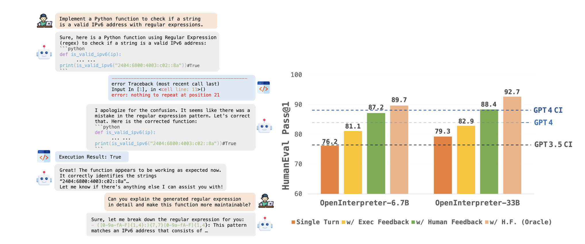

<div style="display: flex; align-items: center;">
  <a href="https://colab.research.google.com/drive/11CisFXTev4NeTyBrbjB8AcSWcE4t0xsP?usp=sharing" style="margin-right: 10px;">
    
  </a>
  <a href="https://www.python.org/" style="margin-right: 10px;">
    
  </a>
  <a href="https://huggingface.co/transformers" style="margin-right: 10px;">
    
  </a>
  <a href="https://gradio.app/">
    
  </a>
</div>
<p style="color: var(--text-color); margin-top: 10px;">Estimated Reading Time: 45 min | Author: Jordan Deklerk</p>

<!-- </div>
</header> 
<style>
  .toc {
    padding: 10px;
    border-radius: 5px;
    background-color: var(--toc-background);
  }
</style>
<div class="toc"> -->
  <details>
    <summary accesskey="c" title="(Alt + C)">
      <span class="details">Table of Contents</span>
    </summary>
    <div class="inner">
      <ul>
        <li><a href="#introduction" aria-label="Introduction">Introduction</a></li>
        <li><a href="#data-preparation" aria-label="Data Preparation">Data Preparation</a></li>
        <li><a href="#the-model" aria-label="The Model">The Model</a>
          <ul>
            <li><a href="#prepare-model" aria-label="Prepare Model">Prepare Model</a>
              <ul>
                <li><a href="#bits-and-bytes-config" aria-label="Bits and Bytes Config">Bits and Bytes Config</a></li>
              </ul>
            </li>
            <li><a href="#new-lora-config" aria-label="New LoRA+ Config">New LoRA+ Config</a>
              <ul>
                <li><a href="#applying-lora-in-practice" aria-label="Applying LoRA+ in Practice">Applying LoRA+ in Practice</a></li>
              </ul>
            </li>
          </ul>
        </li>
        <li><a href="#train-the-model" aria-label="Train the Model">Train the Model</a>
          <ul>
            <li><a href="#noisy-embeddings" aria-label="Noisy Embeddings">Noisy Embeddings</a></li>
          </ul>
        </li>
        <li><a href="#inference" aria-label="Inference">Inference</a></li>
        <li><a href="#app-demo" aria-label="App Demo">App Demo</a></li>
        <li><a href="#conclusion" aria-label="Conclusion">Conclusion</a></li>
      </ul>
    </div>
  </details>
<!-- </div> -->

## Introduction <a id="introduction" style="padding-top: 70px; margin-top: -70px; display: block;"></a>

Modern business decisions heavily rely on data, with organizations employing business intelligence tools and methods to analyze extensive data on their operations or market trends. However, deciphering valuable insights from this data often requires specific analytical skills, such as SQL, and a deep understanding of various databases and tools. This reliance leads to bottlenecks and a dependence on data analysts to develop these increasingly complex tools. In response, a multi-billion dollar industry has emerged, providing analytics solutions to overcome these obstacles.

The emergence of large language models promises to disrupt this status quo by facilitating the generation of SQL queries from straightforward natural language inquiries. The development of generative models capable of crafting SQL queries for any database could revolutionize the field, democratizing access to structured data.

This project demonstrates the process of fine-tuning a code-generating LLM for text-to-SQL coding. You can imagine that this would be very useful for organizations to use proprietary code to better align with internal coding standards and learn key insights from their data on the fly. Given the substantial size of these models, traditional fine-tuning approaches can be excessively demanding on computational resources. We'll introduce techniques to effectively fine-tune these models on just a single Nvidia A100 GPU, ensuring a more practical approach for resource-limited environments.

Specifically, we will implement the new **LoRA+** method outlined in the [LoRA+ paper](https://arxiv.org/pdf/2402.12354.pdf). The "+" in LoRA+ indicates an improvement over the standard LoRA, specifically by setting different learning rates for the adapter matrices which increases computation time of fine-tuning.

## Data Preparation <a id="data-preparation" style="padding-top: 70px; margin-top: -70px; display: block;"></a>

In this project, we will use an instruction based text-to-SQL dataset. In this dataset, there are 78,577 examples of natural language queries, SQL CREATE TABLE statements, and SQL Query answering the question using the CREATE statement as context. This dataset was built with text-to-sql LLMs in mind, intending to prevent hallucination of column and table names often seen when trained on text-to-sql datasets. The CREATE TABLE statement can often be copy and pasted from different DBMS and provides table names, column names and their data types. By providing just the CREATE TABLE statement as context, we can hopefully provide better grounding for models without having to provide actual rows of data, limiting token usage and exposure to private, sensitive, or proprietary data.

This curated dataset, which includes repository ID, file paths, and code contents, is accessible on the Hugging Face Hub at [b-mc2/sql-create-context](https://huggingface.co/datasets/b-mc2/sql-create-context).

## The Model <a id="the-model" style="padding-top: 70px; margin-top: -70px; display: block;"></a>

<br>
<figure style="text-align: center;">
  
  <!-- <figcaption style="margin-top: 10px; color: gray;">Figure 1: The architecture of a Variational Autoencoder</figcaption> -->
</figure>
<br><br>

Our fine-tuning efforts will be centered around the [m-a-p/OpenCodeInterpreter-DS-6.7B](https://huggingface.co/m-a-p/OpenCodeInterpreter-DS-6.7B) model. Check out their [website](https://opencodeinterpreter.github.io/) for a detailed exposition of the model and data. As of March 13, 2024, [m-a-p/OpenCodeInterpreter-DS-33B](https://huggingface.co/m-a-p/OpenCodeInterpreter-DS-33B) has claimed the #1 spot on [BigCode Leaderboard](https://huggingface.co/spaces/bigcode/bigcode-models-leaderboard).

OpenCodeInterpreter is a family of open-source code generation systems designed to bridge the gap between large language models and advanced proprietary systems like the GPT-4 Code Interpreter. It significantly advances code generation capabilities by integrating execution and iterative refinement functionalities. The particular model we will be fine-tuning is based on [deepseek-ai/deepseek-coder-6.7b-base](https://huggingface.co/deepseek-ai/deepseek-coder-6.7b-base).

By employing parameter-efficient training techniques, we can run this notebook on a single Nvidia A100 High-RAM GPU. _Training time takes about 4 hours for 11 epochs_, but could be less depending on regularization techniques like callbacks passed in the training arguments, such as early stopping.

For context, I fine-tuned the [bigcode/starcoder2-3b](https://huggingface.co/bigcode/starcoder2-3b), which is half the size of the OpenCodeInterpreter model, on a dataset half the size of the one we will be working on in this project and the training time took around 8 hours for ~ 1 epoch. So the techniques we will be introducing in this project such as QLoRA+ and NEFTune noisy embeddings significantly improve computational speed.

To get started, let's install all the necessary libraries. As you can see, in addition to `transformers` and `datasets`, we'll be using `peft`, `bitsandbytes`, and `flash-attn` to optimize the training. We will use `wandb` to track training and evaluation metrics such as loss and learning rate.

<details>
    <summary>Install Code</summary>

```python
%%capture
!pip install git+https://github.com/huggingface/transformers.git "huggingface_hub[cli]" --upgrade --quiet
!pip install -q datasets peft bitsandbytes flash-attn gradio trl wandb
!huggingface-cli login --token "YOUR HF TOKEN"
```
</details>
<br>

<details>
    <summary>Imports Code</summary>

```python
from dataclasses import dataclass, field
from functools import reduce
from typing import Callable, Dict, List, Optional, Tuple, Union
import os

import torch
import torch.nn as nn
from torch.utils.data import Dataset

from peft.tuners import lora
from transformers.data.data_collator import DataCollator
from transformers.pytorch_utils import ALL_LAYERNORM_LAYERS
from transformers.trainer import (EvalPrediction, PreTrainedModel,
                                  PreTrainedTokenizerBase, TrainerCallback)
from transformers.trainer_pt_utils import get_parameter_names
from transformers.utils import is_sagemaker_mp_enabled, logging

from transformers import (
    AutoModelForCausalLM,
    AutoTokenizer,
    Trainer,
    TrainingArguments,
    logging,
    set_seed,
    BitsAndBytesConfig,
    EarlyStoppingCallback
)

import wandb

set_seed(315)

import warnings
warnings.filterwarnings("ignore")
```
</details>
<br>

In our project, we will use an already existing dataset called [b-mc2/sql-create-context](https://huggingface.co/datasets/b-mc2/sql-create-context), which is a popular natural language text-to-SQL dataset for fine-tuning instruction models to generate SQL queries from English text inputs.

Here are some samples from the dataset:

```json
  {
    "question": "Please show the themes of competitions with host cities having populations larger than 1000.",
    "context": "CREATE TABLE city (City_ID VARCHAR, Population INTEGER); CREATE TABLE farm_competition (Theme VARCHAR, Host_city_ID VARCHAR)",
    "answer": "SELECT T2.Theme FROM city AS T1 JOIN farm_competition AS T2 ON T1.City_ID = T2.Host_city_ID WHERE T1.Population > 1000"
  },

  {
    "question": "Please show the different statuses of cities and the average population of cities with each status.",
    "context": "CREATE TABLE city (Status VARCHAR, Population INTEGER)",
    "answer": "SELECT Status, AVG(Population) FROM city GROUP BY Status"
  },

```

We are going to use `trl` for fine-tuning, which supports popular instruction and conversation dataset formats. This means we only need to convert our dataset to one of the supported formats and `trl` will take care of the rest. Those formats include:

- conversational format

```json
{"messages": [{"role": "system", "content": "You are..."}, {"role": "user", "content": "..."}, {"role": "assistant", "content": "..."}]}
{"messages": [{"role": "system", "content": "You are..."}, {"role": "user", "content": "..."}, {"role": "assistant", "content": "..."}]}
{"messages": [{"role": "system", "content": "You are..."}, {"role": "user", "content": "..."}, {"role": "assistant", "content": "..."}]}
```

- instruction format

```json
{"prompt": "<prompt text>", "completion": "<ideal generated text>"}
{"prompt": "<prompt text>", "completion": "<ideal generated text>"}
{"prompt": "<prompt text>", "completion": "<ideal generated text>"}
```

In our example we are going to load our open-source dataset using the 🤗 Datasets library and then convert it into the the conversational format, where we include the schema definition in the system message for our assistant. We are randomly downsampling the dataset to only 20,000 samples.

Let's define some global variables.

```python
MODEL="m-a-p/OpenCodeInterpreter-DS-6.7B"            # Model checkpoint on the Hugging Face Hub
DATASET="b-mc2/sql-create-context"                   # Dataset on the Hugging Face Hub

SEQ_LENGTH=3072                                      # Sequence length

# Training arguments
MAX_STEPS=1600                                       # max_steps
BATCH_SIZE=8                                         # batch_size
GR_ACC_STEPS=1                                       # gradient_accumulation_steps
LR=2e-4                                              # learning_rate
LR_SCHEDULER_TYPE="cosine"                           # lr_scheduler_type
WEIGHT_DECAY=1e-2                                    # weight_decay
NUM_WARMUP_STEPS=30                                  # num_warmup_steps
EVAL_FREQ=200                                        # eval_freq
SAVE_FREQ=200                                        # save_freq
LOG_FREQ=50                                          # log_freq
OUTPUT_DIR="OpenCodeInterpreter-DS-6.7B-SQL2"        # output_dir
BF16=True                                            # bf16
FP16=False                                           # no_fp16

# LORA
LORA_R=8                                             # lora_r
LORA_ALPHA=32                                        # lora_alpha
LORA_DROPOUT=0.0                                     # lora_dropout
LORA_TARGET_MODULES="q_proj,k_proj,v_proj,o_proj"    # lora_target_modules

# bitsandbytes config
USE_NESTED_QUANT=True                                # use_nested_quant
BNB_4BIT_COMPUTE_DTYPE="bfloat16"                    # bnb_4bit_compute_dtype

SEED=315
```

Let's format our dataset into the correct style for the SFT Trainer class and randomly downsample the dataset to 20,000 samples with 18,000 samples reserved for training and 2,000 for evaluation.

```python
from datasets import load_dataset

# Convert dataset to OAI messages
system_message = """You are an exceptionally intelligent SQL query translator that consistently delivers accurate and reliable responses to user instructions. Users will ask you questions in English and you will generate a SQL query based on the provided SCHEMA.
SCHEMA:
{schema}"""

def create_conversation(sample):
  """
  Converts a single sample from the dataset into a conversation format suitable for training a language model.

  This function formats a given sample into a structured conversation with three roles: system, user, and assistant.
  The system provides a schema based on the context of the sample, the user asks a question, and the assistant provides
  an answer based on the schema and question.

  Parameters:
  - sample (dict): A dictionary containing the keys 'context', 'question', and 'answer', representing a single sample
                   from the dataset.

  Returns:
  - dict: A dictionary with a single key 'messages', which is a list of dictionaries. Each dictionary in the list
          represents a message in the conversation, containing 'role' (system, user, or assistant) and 'content'
          (the text of the message) keys.
  """
  return {
    "messages": [
      {"role": "system", "content": system_message.format(schema=sample["context"])},
      {"role": "user", "content": sample["question"]},
      {"role": "assistant", "content": sample["answer"]}
    ]
  }

# Load dataset from the hub
dataset = load_dataset("b-mc2/sql-create-context", split="train")
dataset = dataset.shuffle().select(range(20000))

# Convert dataset to OAI messages
dataset = dataset.map(create_conversation, remove_columns=dataset.features,batched=False)
# split dataset into 18,000 training samples and 2,000 test samples
dataset = dataset.train_test_split(test_size=0.10)

train_dataset = dataset["train"]
eval_dataset = dataset["test"]
```

### Prepare Model <a id="prepare-model" style="padding-top: 70px; margin-top: -70px; display: block;"></a>

#### Bits and Bytes Config <a id="bits-and-bytes-config" style="padding-top: 70px; margin-top: -70px; display: block;"></a>

Now that the data is prepared, it's time to load the model. We're going to load the quantized version of the model.

This will allow us to reduce memory usage, as quantization represents data with fewer bits. We'll use the `bitsandbytes` library to quantize the model, as it has a nice integration with `transformers`. All we need to do is define a `bitsandbytes` config, and then use it when loading the model. There are different variants of 4bit quantization, but generally, it is recommended to use NF4 quantization for better performance (`bnb_4bit_quant_type="nf4"`). The `bnb_4bit_use_double_quant` option adds a second quantization after the first one to save an additional 0.4 bits per parameter.

To learn more about quantization, check out the ["Making LLMs even more accessible with bitsandbytes, 4-bit quantization and QLoRA" blog post](https://huggingface.co/blog/4bit-transformers-bitsandbytes).

Once defined, pass the config to the `from_pretrained` method to load the quantized version of the model.

```python
from peft import LoraConfig, get_peft_model, prepare_model_for_kbit_training
from peft.tuners.lora import LoraLayer

load_in_8bit = False

# 4-bit quantization
compute_dtype = getattr(torch, BNB_4BIT_COMPUTE_DTYPE)

bnb_config = BitsAndBytesConfig(
    load_in_4bit=True,
    bnb_4bit_quant_type="nf4",
    bnb_4bit_compute_dtype=compute_dtype,
    bnb_4bit_use_double_quant=USE_NESTED_QUANT,
)

device_map = {"": 0}

model = AutoModelForCausalLM.from_pretrained(
        MODEL,
        load_in_8bit=load_in_8bit,
        quantization_config=bnb_config,
        device_map=device_map,
        use_cache=False,  # We are using gradient checkpointing
        trust_remote_code=True,
        attn_implementation="flash_attention_2",
)

tokenizer = AutoTokenizer.from_pretrained(MODEL, use_fast=True)
tokenizer.pad_token = tokenizer.eos_token
```

When using a quantized model for training, you need to call the `prepare_model_for_kbit_training()` function to preprocess the quantized model for training.

```python
model = prepare_model_for_kbit_training(model)
model
```

```
Output:

LlamaForCausalLM(
  (model): LlamaModel(
    (embed_tokens): Embedding(32256, 4096)
    (layers): ModuleList(
      (0-31): 32 x LlamaDecoderLayer(
        (self_attn): LlamaFlashAttention2(
          (q_proj): Linear4bit(in_features=4096, out_features=4096, bias=False)
          (k_proj): Linear4bit(in_features=4096, out_features=4096, bias=False)
          (v_proj): Linear4bit(in_features=4096, out_features=4096, bias=False)
          (o_proj): Linear4bit(in_features=4096, out_features=4096, bias=False)
          (rotary_emb): LlamaLinearScalingRotaryEmbedding()
        )
        (mlp): LlamaMLP(
          (gate_proj): Linear4bit(in_features=4096, out_features=11008, bias=False)
          (up_proj): Linear4bit(in_features=4096, out_features=11008, bias=False)
          (down_proj): Linear4bit(in_features=11008, out_features=4096, bias=False)
          (act_fn): SiLU()
        )
        (input_layernorm): LlamaRMSNorm()
        (post_attention_layernorm): LlamaRMSNorm()
      )
    )
    (norm): LlamaRMSNorm()
  )
  (lm_head): Linear(in_features=4096, out_features=32256, bias=False)
)
```

### New LoRA+ Config <a id="new-lora-config" style="padding-top: 70px; margin-top: -70px; display: block;"></a>

Now that the quantized model is ready, we can set up a LoRA+ configuration. LoRA+ makes fine-tuning more efficient by drastically reducing the number of trainable parameters just as the taditional LoRA approach, except we can now specify different learning rates for the adapter matrices. In the paper, the authors indicate that this improves computational fine-tuning by 2x the speed in some cases.

To train a model using LoRA+ technique, we need to wrap the base model as a `PeftModel`. This involves defining a LoRA+ configuration with `LoraConfig`, and wrapping the original model with `get_peft_model()` using the `LoraConfig`. To learn more about the original LoRA and its parameters, refer to [PEFT documentation](https://huggingface.co/docs/peft/conceptual_guides/lora). To learn more about LoRA+, refer to the [LoRA+ paper](https://arxiv.org/pdf/2402.12354.pdf).

The author's originally created a new 🤗 `Trainer` class called the `LoraPlusTrainer`, which is essentially a wrapper for the 🤗 `Trainer` class with a modified optimizer function to allow for different learning rates on the adapter matrices. However, we will be using the `SFTTrainer`, so we need to modify the original `LoraPlusTrainer` slightly to wrap around the `SFTTrainer` as well.

You can find the original LoRA+ code [here](https://github.com/nikhil-ghosh-berkeley/loraplus/blob/main/lora_plus.py).

#### Applying LoRA+ in Practice <a id="applying-lora-in-practice" style="padding-top: 70px; margin-top: -70px; display: block;"></a>

LoRA+ introduces one new required hyperparameter to your optimizer (and another optional hyperparameter). Setting this hyperparameter appropriately can improve finetuning performance, especially on more challenging downstream tasks.

#### LoRA+ arguments

`loraplus_lr_ratio`: the ratio of learning rates $\eta_A / \eta_B$ where $\eta_A$ is passed in as the optimizer learning rate (e.g., learning_rate or lr). As a rule of thumb, `loraplus_lr_ratio` should be larger when the task is more difficult and the model needs to update its features to learn well. In this case, it helps to make the learning rate slightly smaller (e.g., by a factor of 2) than typical vanilla LoRA learning rates.

`loraplus_lr_embedding`: (optional) if LoRA modules are added to embedding layers, you can specify a different learning rate for them. Default value 1e-6.
Note that `loraplus_lr_ratio` should be greater than 1, and when it is equal to 1 this is just the regular LoRA configuration. The optimal choice of `loraplus_lr_ratio` is model and task dependent and needs to be set in tandem with the optimizer learning rate.

Here is the wrapper for the LoRA+ code.

<details>
    <summary>LoRA+ Code</summary>

```python
# Modified from https://github.com/nikhil-ghosh-berkeley/loraplus/blob/main/lora_plus.py

from dataclasses import dataclass, field
from functools import reduce
from typing import Callable, Dict, List, Optional, Tuple, Union

import torch
import torch.nn as nn
from torch.utils.data import Dataset

from peft.tuners import lora
from transformers import Trainer, TrainingArguments
from transformers.data.data_collator import DataCollator
from transformers.pytorch_utils import ALL_LAYERNORM_LAYERS
from transformers.trainer import EvalPrediction, PreTrainedModel, PreTrainedTokenizerBase, TrainerCallback
from transformers.trainer_pt_utils import get_parameter_names
from transformers.utils import is_sagemaker_mp_enabled, logging

from trl import SFTTrainer

if is_sagemaker_mp_enabled():
    import smdistributed.modelparallel.torch as smp

logger = logging.get_logger(__name__)


@dataclass
class LoraPlusTrainingArguments(TrainingArguments):
    loraplus_lr_ratio: Optional[float] = field(
        default=None, metadata={"help": "loraplus learning rate ratio lr_B / lr_A."}
    )
    loraplus_lr_embedding: Optional[float] = field(
        default=1e-6,
        metadata={"help": "loraplus learning rate for lora embedding layers."},
    )


def get_module(name, opt_model):
    """
    Retrieve a module from a model using its parameter name.
    Args:
        name (str): Full name of the parameter, typically including module path.
        opt_model (torch.nn.Module): The model from which to retrieve the module.

    Returns:
        Module corresponding to the given name.
    """
    parent_idx = 2 if "lora" in name else 1
    module_names = name.split(sep=".")[:-parent_idx]
    module = reduce(getattr, module_names, opt_model)
    return module


def create_loraplus_optimizer(
    opt_model,
    optimizer_cls,
    optimizer_kwargs,
    loraplus_lr_ratio,
    loraplus_lr_embedding=None,
):
    """
    Creates an optimizer for the given model, applying LoRA-specific learning rate adjustments to different parameter groups.

    Args:
        opt_model (torch.nn.Module): The model for which the optimizer is being created.
        optimizer_cls (class): The class of the optimizer to be used (e.g., torch.optim.Adam).
        optimizer_kwargs (dict): A dictionary of keyword arguments for the optimizer's initialization.
        loraplus_lr_ratio (float): The learning rate ratio to be applied to LoRA parameters.
        loraplus_lr_embedding (float, optional): A specific learning rate for embedding parameters, with a default value if not provided.

    Returns:
        An instance of the specified optimizer class configured with the model's parameters organized into groups with custom learning rates.
    """

    assert loraplus_lr_ratio is not None, "loraplus_lr_ratio must be provided."

    if loraplus_lr_embedding is None:
        loraplus_lr_embedding = 1e-6

    decay_parameters = get_parameter_names(opt_model, ALL_LAYERNORM_LAYERS)
    decay_parameters = [name for name in decay_parameters if "bias" not in name]
    param_groups = {
        "groupA": {},
        "groupB": {},
        "groupB_no_decay": {},
        "embedding": {},
    }

    for name, param in opt_model.named_parameters():
        if not param.requires_grad:
            continue

        module = get_module(name, opt_model)
        if isinstance(module, lora.Embedding):
            param_groups["embedding"][name] = param
        elif "lora_B" in name or param.ndim == 1:
            if name in decay_parameters:
                param_groups["groupB"][name] = param
            else:
                param_groups["groupB_no_decay"][name] = param
        else:
            param_groups["groupA"][name] = param

    assigned_param_groups = ""
    for group in param_groups:
        assigned_param_groups += f"{group}\n {list(param_groups[group].keys())}\n\n"
    logger.info(assigned_param_groups)

    lr = optimizer_kwargs["lr"]
    weight_decay = optimizer_kwargs.get("weight_decay", 0.0)

    optimizer_grouped_parameters = [
        {
            "params": list(param_groups["groupA"].values()),
            "weight_decay": weight_decay,
            "lr": lr,
        },
        {
            "params": list(param_groups["embedding"].values()),
            "weight_decay": weight_decay,
            "lr": loraplus_lr_embedding,
        },
        {
            "params": list(param_groups["groupB"].values()),
            "weight_decay": weight_decay,
            "lr": lr * loraplus_lr_ratio,
        },
        {
            "params": list(param_groups["groupB_no_decay"].values()),
            "weight_decay": 0.0,
            "lr": lr * loraplus_lr_ratio,
        },
    ]

    optimizer = optimizer_cls(optimizer_grouped_parameters, **optimizer_kwargs)
    if optimizer_cls.__name__ == "Adam8bit":
        import bitsandbytes

        manager = bitsandbytes.optim.GlobalOptimManager.get_instance()

        skipped = 0
        for module in opt_model.modules():
            if isinstance(module, nn.Embedding):
                skipped += sum({p.data_ptr(): p.numel() for p in module.parameters()}.values())
                logger.info(f"skipped {module}: {skipped/2**20}M params")
                manager.register_module_override(module, "weight", {"optim_bits": 32})
                logger.debug(f"bitsandbytes: will optimize {module} in fp32")
        logger.info(f"skipped: {skipped/2**20}M params")

    return optimizer

# Wrap the SFTTrainer
class LoraPlusSFTTrainer(SFTTrainer):
    """
    The LoraPlusSFTTrainer class extends the SFTTrainer from the 🤗 Transformers library to incorporate
    LoRA+ (Low-Rank Adaptation Plus) fine-tuning capabilities. This trainer allows for efficient fine-tuning
    of large language models (LLMs) by applying LoRA+ techniques, which adjust the learning rates for specific
    adapter matrices, enabling faster convergence and reduced computational resources.

    LoRA+ is an enhancement over the standard LoRA technique, offering the ability to specify different learning
    rates for the adapter matrices, thus improving the fine-tuning process's efficiency. This class also supports
    noisy embeddings fine-tuning (NEFTune), a method that adds random noise to the embedding vectors during training,
    potentially improving model performance on downstream tasks.

    The class constructor takes various parameters to configure the training process, including the model to be fine-tuned,
    training arguments, data collators, datasets, and tokenizer. It also allows for the specification of callbacks,
    optimizers, and additional configurations related to PEFT (Parameter-Efficient Fine-Tuning), dataset processing,
    and NEFTune settings.

    Parameters:
    - model: The model to be fine-tuned, which can be a PreTrainedModel or a custom nn.Module.
    - args: Training arguments specific to LoRA+ fine-tuning, encapsulated in the LoraPlusTrainingArguments class.
    - data_collator: Optional data collator instance to prepare batches for training or evaluation.
    - train_dataset: The dataset used for training.
    - eval_dataset: The dataset used for evaluation.
    - tokenizer: Tokenizer instance for processing text inputs.
    - model_init: Optional callable that returns a model instance, used for initializing the model.
    - compute_metrics: Optional callable for computing custom metrics during evaluation.
    - callbacks: Optional list of TrainerCallback instances for custom callback functionality.
    - optimizers: Tuple containing the optimizer and learning rate scheduler to be used for training.
    - preprocess_logits_for_metrics: Optional callable for preprocessing logits before computing metrics.
    - peft_config: Optional PEFT configuration for parameter-efficient fine-tuning.
    - dataset_text_field: Optional string specifying the text field in the dataset.
    - packing: Boolean indicating whether to use packing for training.
    - formatting_func: Optional callable for custom formatting of the dataset.
    - max_seq_length: Maximum sequence length for model inputs.
    - infinite: Boolean indicating whether to use an infinite dataset generator.
    - num_of_sequences: Number of sequences to generate for the infinite dataset.
    - chars_per_token: Average number of characters per token, used for estimating dataset size.
    - dataset_num_proc: Number of processes to use for dataset preprocessing.
    - dataset_batch_size: Batch size for dataset preprocessing.
    - neftune_noise_alpha: Alpha parameter for NEFTune noisy embeddings.
    - model_init_kwargs: Optional dictionary of keyword arguments for model initialization.
    - dataset_kwargs: Optional dictionary of keyword arguments for dataset processing.
    - eval_packing: Boolean indicating whether to use packing for evaluation.
    """
    def __init__(
        self,
        model: Union[PreTrainedModel, nn.Module] = None,
        args: LoraPlusTrainingArguments = None,
        data_collator: Optional[DataCollator] = None,
        train_dataset: Optional[Dataset] = None,
        eval_dataset: Optional[Union[Dataset, Dict[str, Dataset]]] = None,
        tokenizer: Optional[PreTrainedTokenizerBase] = None,
        model_init: Optional[Callable[[], PreTrainedModel]] = None,
        compute_metrics: Optional[Callable[[EvalPrediction], Dict]] = None,
        callbacks: Optional[List[TrainerCallback]] = None,
        optimizers: Tuple[torch.optim.Optimizer, torch.optim.lr_scheduler.LambdaLR] = (None, None),
        preprocess_logits_for_metrics: Optional[Callable[[torch.Tensor, torch.Tensor], torch.Tensor]] = None,
        peft_config: Optional["PeftConfig"] = None,
        dataset_text_field: Optional[str] = None,
        packing: Optional[bool] = False,
        formatting_func: Optional[Callable] = None,
        max_seq_length: Optional[int] = None,
        infinite: Optional[bool] = None,
        num_of_sequences: Optional[int] = 1024,
        chars_per_token: Optional[float] = 3.6,
        dataset_num_proc: Optional[int] = None,
        dataset_batch_size: int = 1000,
        neftune_noise_alpha: Optional[float] = None,
        model_init_kwargs: Optional[Dict] = None,
        dataset_kwargs: Optional[Dict] = None,
        eval_packing: Optional[bool] = None,
    ):
        if args.loraplus_lr_ratio is not None:
            opt_model = model.module if is_sagemaker_mp_enabled() else model
            optimizer_cls, optimizer_kwargs = Trainer.get_optimizer_cls_and_kwargs(args)
            loraplus_lr_ratio = getattr(args, "loraplus_lr_ratio", None)
            loraplus_lr_embedding = getattr(args, "loraplus_lr_embedding", None)
            optimizer = create_loraplus_optimizer(
                opt_model,
                optimizer_cls,
                optimizer_kwargs,
                loraplus_lr_ratio,
                loraplus_lr_embedding,
            )
            optimizers = (optimizer, None)

        super().__init__(
            model=model,
            args=args,
            data_collator=data_collator,
            train_dataset=train_dataset,
            eval_dataset=eval_dataset,
            tokenizer=tokenizer,
            model_init=model_init,
            compute_metrics=compute_metrics,
            callbacks=callbacks,
            optimizers=optimizers,
            preprocess_logits_for_metrics=preprocess_logits_for_metrics,
            peft_config=peft_config,
            dataset_text_field=dataset_text_field,
            packing=packing,
            formatting_func=formatting_func,
            max_seq_length=max_seq_length,
            infinite=infinite,
            num_of_sequences=num_of_sequences,
            chars_per_token=chars_per_token,
            dataset_num_proc=dataset_num_proc,
            dataset_batch_size=dataset_batch_size,
            neftune_noise_alpha=neftune_noise_alpha,
            model_init_kwargs=model_init_kwargs,
            dataset_kwargs=dataset_kwargs,
            eval_packing=eval_packing,
        )
```
</details>
<br>

Now let's setup the PEFT configuration.

```python
# Set up lora
peft_config = LoraConfig(
    lora_alpha=LORA_ALPHA,
    lora_dropout=LORA_DROPOUT,
    r=LORA_R,
    bias="none",
    task_type="CAUSAL_LM",
    target_modules=LORA_TARGET_MODULES.split(","),
)

model = get_peft_model(model, peft_config)
model.print_trainable_parameters()
```

```
Output:

trainable params: 8,388,608 || all params: 6,748,901,376 || trainable%: 0.12429590436498326
```

As you can see, by applying LoRA technique, we will now need to train less than 1% of the parameters which significantly boosts training speed.

## Train the Model <a id="train-the-model" style="padding-top: 70px; margin-top: -70px; display: block;"></a>

**Noisy Embeddings**

We will be using noisy embeddings for fine-tuning outlined in [NEFTune: Noisy Embeddings Improve Instruction Finetuning](https://arxiv.org/pdf/2310.05914.pdf). This method adds random noise to the embedding vectors of the training data during the forward pass of fine-tuning. Specifically, each step of NEFTune begins by sampling an instruction from the dataset, and converting its tokens to embedding vectors. NEFTune then departs from standard training by adding a random noise vector to the embeddings. The noise is generated by sampling iid uniform entries, each in the range $[-1,1]$, and then scaling the entire noise vector by a factor of $\alpha / \sqrt{L d}$, where $L$ is the sequence length, $d$ is the embedding dimension, and $\alpha$ is a tunable parameter. The author's note that the scaling rule was borrowed from the adversarial ML literature, and results in a random vector with an expected Euclidean magnitude of approximately $\alpha / \sqrt{3}$.

The 🤗 `SFTTrainer` provides an easy way to incorporate NEFTTune by simply passing the `neftune_noise_alpha` argument into the trainer, which is the `LoraPlusSFTTrainer` in our case. The authors of the NEFTTune paper show that noisy embeddings can dramatically improve fine-tuning accuracy on downstream instruction tasks in many cases without sacrificing any computational over-head, or as they call it, a free lunch for LLM fine-tuning!

Now that we have prepared the data, and optimized the model, we are ready to bring everything together to start the training.

To instantiate a `LoraPlusSFTTrainer`, you need to define the training configuration like we normally do for any 🤗 trainer. The most important is the `LoraPlusTrainingArguments`, which is a class that contains all the attributes to configure the training just like the typical `TrainingArguments` class.

```python
os.environ["WANDB_PROJECT"] = f'{OUTPUT_DIR}'
early_stopping_callback = EarlyStoppingCallback(early_stopping_patience=1)

training_args = LoraPlusTrainingArguments(
    output_dir=f"jdeklerk10/{OUTPUT_DIR}",
    dataloader_drop_last=True,
    evaluation_strategy="steps",
    save_strategy="steps",
    max_steps=MAX_STEPS,
    eval_steps=EVAL_FREQ,
    save_steps=SAVE_FREQ,
    logging_steps=LOG_FREQ,
    per_device_train_batch_size=BATCH_SIZE,
    per_device_eval_batch_size=BATCH_SIZE,
    learning_rate=LR,
    lr_scheduler_type=LR_SCHEDULER_TYPE,
    warmup_steps=NUM_WARMUP_STEPS,
    gradient_accumulation_steps=GR_ACC_STEPS,
    gradient_checkpointing=True,
    fp16=FP16,
    bf16=BF16,
    weight_decay=WEIGHT_DECAY,
    push_to_hub=True,
    include_tokens_per_second=True,
    loraplus_lr_ratio=1.25,                #LoRA+ learning rate for the B matrix (using author's suggestion in the paper)
    loraplus_lr_embedding=1e-6,           #LoRA+ learning rate for the embedding (using author's suggestion in the paper)
    metric_for_best_model='eval_loss',
    report_to='wandb',
    load_best_model_at_end = True,
)
```

Now we can instantiate the `LoraPlusSFTTrainer` and call the `train` method to begin fine-tuning our LLM.

```python
trainer = LoraPlusSFTTrainer(
        model=model,
        args=training_args,
        train_dataset=train_dataset,
        eval_dataset=eval_dataset,
        peft_config=peft_config,
        max_seq_length=3072,
        tokenizer=tokenizer,
        neftune_noise_alpha = 5,                # Author's typically use 5 for smaller models from what I can see in the paper
        packing=True,
        callbacks=[early_stopping_callback],
        dataset_kwargs={
            "add_special_tokens": False,        # We template with special tokens
            "append_concat_token": False,       # No need to add additional separator token
        },
    )

trainer.train()
wandb.finish()
trainer.save_model(f"{OUTPUT_DIR}/qlora_plus_model")
```

We tested out a few different training regimes and found that training for about 11 epochs worked best. Finally, you can push the fine-tuned model to your Hub repository. Total training time took around 4 hours!

```python
trainer.push_to_hub()
```

## Inference <a id="inference" style="padding-top: 70px; margin-top: -70px; display: block;"></a>

Once the model is uploaded to Hub, we can use it for inference. To do so we first initialize the original base model and its tokenizer. Next, we need to merge the fine-tuned weights with the base model.

```python
from peft import PeftModel
import torch

# load the original model first
tokenizer = AutoTokenizer.from_pretrained(MODEL, trust_remote_code=True)
base_model = AutoModelForCausalLM.from_pretrained(
    MODEL,
    quantization_config=None,
    device_map=None,
    trust_remote_code=True,
    torch_dtype=torch.bfloat16,
).cuda()

# merge fine-tuned weights with the base model
peft_model_id = f"jdeklerk10/{OUTPUT_DIR}"
model = PeftModel.from_pretrained(base_model, peft_model_id)
model.merge_and_unload()
```

```
Output:

LlamaForCausalLM(
  (model): LlamaModel(
    (embed_tokens): Embedding(32256, 4096)
    (layers): ModuleList(
      (0-31): 32 x LlamaDecoderLayer(
        (self_attn): LlamaSdpaAttention(
          (q_proj): Linear(in_features=4096, out_features=4096, bias=False)
          (k_proj): Linear(in_features=4096, out_features=4096, bias=False)
          (v_proj): Linear(in_features=4096, out_features=4096, bias=False)
          (o_proj): Linear(in_features=4096, out_features=4096, bias=False)
          (rotary_emb): LlamaLinearScalingRotaryEmbedding()
        )
        (mlp): LlamaMLP(
          (gate_proj): Linear(in_features=4096, out_features=11008, bias=False)
          (up_proj): Linear(in_features=4096, out_features=11008, bias=False)
          (down_proj): Linear(in_features=11008, out_features=4096, bias=False)
          (act_fn): SiLU()
        )
        (input_layernorm): LlamaRMSNorm()
        (post_attention_layernorm): LlamaRMSNorm()
      )
    )
    (norm): LlamaRMSNorm()
  )
  (lm_head): Linear(in_features=4096, out_features=32256, bias=False)
)
```

Now we need to create a function to generate SQL queries from the model given an input question and context.

```python
def generate_sql(messages):
    """
    Generates an SQL query based on a series of messages using a fine-tuned language model.

    This function takes a list of messages, each containing a "role" and "content" key. The roles
    can be either "system" or "user", indicating the source of the message. The function constructs
    a prompt from these messages by appending each message's content to a string, prefixed by the
    role of the message sender.

    The constructed prompt is then encoded using a tokenizer, and the resulting input IDs and
    attention mask are passed to a pre-trained language model. The model generates an output sequence
    based on these inputs.

    The function extracts an SQL query from the generated text. It searches for the start of the SQL
    query, identified by the keyword "SELECT", and captures the text up to the next newline character
    or the end of the generated text if no newline is found. This extracted SQL query is then returned.

    Parameters:
    - messages (List[Dict[str, str]]): A list of dictionaries, where each dictionary represents a message
      and contains keys for "role" (either "system" or "user") and "content" (the message text).

    Returns:
    - str: The generated SQL query extracted from the model's output.
    """
    prompt = ""
    for message in messages:
        if message["role"] == "system":
            prompt += f"System: {message['content']}\n"
        elif message["role"] == "user":
            prompt += f"User: {message['content']}\n"

    inputs = tokenizer.encode_plus(
        prompt,
        return_tensors="pt",
        padding="longest",
        truncation=True,
        max_length=3072,
    )

    input_ids = inputs["input_ids"].cuda()
    attention_mask = inputs["attention_mask"].cuda()

    output = model.generate(
        input_ids,
        attention_mask=attention_mask,
        max_length=1000,
        num_return_sequences=1,
        temperature=0.0,
        pad_token_id=tokenizer.eos_token_id,
    )

    generated_text = tokenizer.decode(output[0], skip_special_tokens=True)

    sql_start_index = generated_text.find("SELECT")
    sql_end_index = generated_text.find("\n", sql_start_index)
    if sql_end_index == -1:
        sql_end_index = len(generated_text)
    generated_sql = generated_text[sql_start_index:sql_end_index].strip()

    return generated_sql
```

Now that we have our `generate_sql` function, we can iterate through the evaluation dataset and see how well our model performs in terms of accuracy, i.e., does our model output a SQL query that exactly matches the ground truth query in the evaluation sample.

Keep in mind that evaluating generative models is not trivial. In our method, we will initially look at the accuracy of the generated SQL based on the ground truth SQL query as our metric. An alternative way could be to automatically execute the generated SQL query and compare the results with the ground truth. This would be a more accurate metric but requires more work to setup.

Let's look at a simple query to see how the model performs.

<details>
    <summary>Simple Query Code</summary>

```python
total_samples = 0
correct_predictions = 0

sample_index = 1500
sample = eval_dataset[sample_index]
messages = sample["messages"]

schema = messages[0]["content"].split("SCHEMA:\n")[1]
user_question = messages[1]["content"]
ground_truth_sql = messages[-1]["content"]

# Generate SQL query using the fine-tuned model
generated_sql = generate_sql(messages[:-1])

print("Schema Context:")
print(schema)
print("\nUser Question:")
print(user_question)
print("\n" + "-" * 50 + "\n")
print("Generated SQL:")
print(generated_sql)
print("\nGround Truth SQL:")
print(ground_truth_sql)
print("\n" + "-" * 50 + "\n")

# Normalize the SQL queries
generated_sql_normalized = " ".join(generated_sql.lower().split())
ground_truth_sql_normalized = " ".join(ground_truth_sql.lower().split())

print("Normalized Generated SQL:")
print(generated_sql_normalized)
print("\nNormalized Ground Truth SQL:")
print(ground_truth_sql_normalized)

if generated_sql_normalized == ground_truth_sql_normalized:
   correct_predictions += 1

total_samples += 1

print("\n" + "-" * 50 + "\n")
accuracy = correct_predictions / total_samples
print(f"Accuracy: {accuracy:.2f}")
```
</details>
<br>

```
Output:

Schema Context:
CREATE TABLE table_name_29 (entered_service VARCHAR, serial_no VARCHAR)

User Question:
What is the entered service date for serial number 85-1222?

--------------------------------------------------

Generated SQL:
SELECT entered_service FROM table_name_29 WHERE serial_no = "85-1222"

Ground Truth SQL:
SELECT entered_service FROM table_name_29 WHERE serial_no = "85-1222"

--------------------------------------------------

Normalized Generated SQL:
select entered_service from table_name_29 where serial_no = "85-1222"

Normalized Ground Truth SQL:
select entered_service from table_name_29 where serial_no = "85-1222"

--------------------------------------------------

Accuracy: 1.00
```

We can see that our fine-tuned model generates the exact query as the ground truth. But this example was pretty easy. Now let's look at a more complicated query to see how the model does.

<details>
    <summary>Hard Query Code</summary>

```python
total_samples = 0
correct_predictions = 0

# Find a sample with a ground truth SQL of more than 50 tokens
sample_index = None
for i, sample in enumerate(eval_dataset):
    messages = sample["messages"]
    ground_truth_sql = messages[-1]["content"]
    if len(ground_truth_sql.split()) > 50:
        sample_index = i
        break

if sample_index is not None:
    sample = eval_dataset[sample_index]
    messages = sample["messages"]

    schema = messages[0]["content"].split("SCHEMA:\n")[1]
    user_question = messages[1]["content"]
    ground_truth_sql = messages[-1]["content"]

    # Generate SQL query using our fine-tuned model
    generated_sql = generate_sql(messages[:-1])

    print("Schema Context:")
    print(schema)
    print("\nUser Question:")
    print(user_question)
    print("\n" + "-" * 50 + "\n")
    print("Generated SQL:")
    print(generated_sql)
    print("\nGround Truth SQL:")
    print(ground_truth_sql)
    print("\n" + "-" * 50 + "\n")

    # Normalize the SQL queries
    generated_sql_normalized = " ".join(generated_sql.lower().split())
    ground_truth_sql_normalized = " ".join(ground_truth_sql.lower().split())

    print("Normalized Generated SQL:")
    print(generated_sql_normalized)
    print("\nNormalized Ground Truth SQL:")
    print(ground_truth_sql_normalized)

    if generated_sql_normalized == ground_truth_sql_normalized:
        correct_predictions += 1

    total_samples += 1

    print("\n" + "-" * 50 + "\n")

    accuracy = correct_predictions / total_samples
    print(f"Accuracy: {accuracy:.2f}")

else:
    print("No query found with a ground truth SQL of more than 50 tokens.")
```
</details>
<br>

```
Output:

Schema Context:
CREATE TABLE votes (contestant_number VARCHAR, state VARCHAR); CREATE TABLE contestants (contestant_number VARCHAR, contestant_name VARCHAR); CREATE TABLE area_code_state (area_code VARCHAR, state VARCHAR)

User Question:
List the area codes in which voters voted both for the contestant 'Tabatha Gehling' and the contestant 'Kelly Clauss'.

--------------------------------------------------

Generated SQL:
SELECT area_code FROM area_code_state AS a JOIN votes AS v1 ON a.state = v1.state JOIN votes AS v2 ON a.state = v2.state JOIN contestants AS t1 ON v1.contestant_number = t1.contestant_number JOIN contestants AS t2 ON v2.contestant_number = t2.contestant_number WHERE t1.contestant_name = 'Tabatha Gehling' AND t2.contestant_name = 'Kelly Clauss'

Ground Truth SQL:
SELECT T3.area_code FROM contestants AS T1 JOIN votes AS T2 ON T1.contestant_number = T2.contestant_number JOIN area_code_state AS T3 ON T2.state = T3.state WHERE T1.contestant_name = 'Tabatha Gehling' INTERSECT SELECT T3.area_code FROM contestants AS T1 JOIN votes AS T2 ON T1.contestant_number = T2.contestant_number JOIN area_code_state AS T3 ON T2.state = T3.state WHERE T1.contestant_name = 'Kelly Clauss'

--------------------------------------------------

Normalized Generated SQL:
select area_code from area_code_state as a join votes as v1 on a.state = v1.state join votes as v2 on a.state = v2.state join contestants as t1 on v1.contestant_number = t1.contestant_number join contestants as t2 on v2.contestant_number = t2.contestant_number where t1.contestant_name = 'tabatha gehling' and t2.contestant_name = 'kelly clauss'

Normalized Ground Truth SQL:
select t3.area_code from contestants as t1 join votes as t2 on t1.contestant_number = t2.contestant_number join area_code_state as t3 on t2.state = t3.state where t1.contestant_name = 'tabatha gehling' intersect select t3.area_code from contestants as t1 join votes as t2 on t1.contestant_number = t2.contestant_number join area_code_state as t3 on t2.state = t3.state where t1.contestant_name = 'kelly clauss'

--------------------------------------------------

Accuracy: 0.00
```

When dealing with more complex queries, our fine-tuned model may generate a query that doesn't exactly match the ground truth, resulting in an accuracy of 0. However, it's important to delve deeper and examine the example more closely.

SQL queries can be written in multiple ways to return the same data. To accurately assess how well our fine-tuned model performs compared to the ground truth query, we should focus on the data returned by both queries, the so called **execution accuracy**. If the generated query yields the same results as the ground truth query, it can be considered accurate, even if the semantic structure of the queries doesn't match precisely.

To better understand the performance of our model, let's create a simple sample database with data that aligns with the context and schema of this challenging query. By populating the database and executing both the generated query and the ground truth query, we can compare the returned results. This evaluation approach will provide valuable insights into the model's ability to generate queries that produce the desired output, regardless of the specific query structure.

```python
import sqlite3
import pandas as pd

def execute_query(cursor, query):
    """
    Executes a SQL query using the provided cursor and returns the results along with column names.

    Parameters:
    - cursor (sqlite3.Cursor): The cursor object used to execute SQL commands.
    - query (str): The SQL query string to be executed.

    Returns:
    - tuple: A tuple containing two elements. The first element is a list of tuples representing the query results.
             Each tuple corresponds to a row in the result set. The second element is a list of strings representing
             the column names of the result set. If an error occurs during query execution, returns None for both elements.
    """
    try:
        cursor.execute(query)
        result = cursor.fetchall()
        columns = [description[0] for description in cursor.description]
        return result, columns
    except sqlite3.Error as e:
        print(f"Error executing query: {e}")
        return None, None

def evaluate_queries(schema, generated_sql, ground_truth_sql):
    """
    Evaluates the accuracy of a generated SQL query against a ground truth SQL query by executing both queries
    against a database schema populated with sample data. The function first creates an in-memory SQLite database
    and populates it with sample data according to the provided schema. It then executes both the generated and
    the ground truth SQL queries and compares their results.

    Parameters:
    - schema (str): A string containing SQL statements to create tables in the database schema.
    - generated_sql (str): The SQL query generated by the model.
    - ground_truth_sql (str): The SQL query that represents the correct answer.

    Returns:
    - bool: True if the results of the generated SQL query match the results of the ground truth SQL query,
            False otherwise.
    """
    conn = sqlite3.connect(":memory:")
    cursor = conn.cursor()

    try:
        for create_table_stmt in schema.split(";"):
            cursor.execute(create_table_stmt)

        # Sample data
        sample_data = {
            "votes": [
                ("1", "CA"), ("2", "NY"), ("1", "NY"),
                ("3", "CA"), ("4", "NY"), ("3", "NY"),
                ("5", "CA"), ("5", "NY")
            ],
            "contestants": [
                ("1", "Tabatha Gehling"), ("2", "Kelly Clauss"),
                ("3", "John Doe"), ("4", "Jane Smith"),
                ("5", "Michael Johnson")
            ],
            "area_code_state": [
                ("415", "CA"), ("212", "NY"),
                ("213", "CA"), ("718", "NY")
            ]
        }

        print("\n" + "-" * 50 + "\n")
        print("Sample Data:")
        print("\n" + "-" * 50 + "\n")

        for table_name, table_data in sample_data.items():
            insert_stmt = f"INSERT INTO {table_name} VALUES (?, ?)"
            cursor.executemany(insert_stmt, table_data)

            columns = [description[0] for description in cursor.execute(f"SELECT * FROM {table_name}").description]
            df = pd.DataFrame(table_data, columns=columns)
            print(f"{table_name}:")
            print(df)
            print("\n" + "-" * 50 + "\n")

        # Run the generated SQL query
        generated_result, generated_columns = execute_query(cursor, generated_sql)
        generated_df = pd.DataFrame(generated_result, columns=generated_columns)

        # Run the ground truth SQL query
        ground_truth_result, ground_truth_columns = execute_query(cursor, ground_truth_sql)
        ground_truth_df = pd.DataFrame(ground_truth_result, columns=ground_truth_columns)

        print("Query Results:")
        print("\n" + "-" * 50 + "\n")

        print("Generated Query Result:")
        print(generated_df)
        print("\n" + "-" * 50 + "\n")

        print("Ground Truth Query Result:")
        print(ground_truth_df)
        print("\n" + "-" * 50 + "\n")

        if generated_df.equals(ground_truth_df):
            print("The generated query and the ground truth query return the same results.")
            return True
        else:
            print("The generated query and the ground truth query return different results.")
            return False

    except sqlite3.Error as e:
        print(f"Error: {e}")
        return False

    finally:
        conn.close()

schema = "CREATE TABLE votes (contestant_number VARCHAR, state VARCHAR); CREATE TABLE contestants (contestant_number VARCHAR, contestant_name VARCHAR); CREATE TABLE area_code_state (area_code VARCHAR, state VARCHAR)"
generated_sql = "SELECT T1.area_code FROM area_code_state AS T1 JOIN votes AS T2 ON T1.state = T2.state JOIN contestants AS T3 ON T2.contestant_number = T3.contestant_number WHERE T3.contestant_name = 'Tabatha Gehling' INTERSECT SELECT T1.area_code FROM area_code_state AS T1 JOIN votes AS T2 ON T1.state = T2.state JOIN contestants AS T3 ON T2.contestant_number = T3.contestant_number WHERE T3.contestant_name = 'Kelly Clauss'"
ground_truth_sql = "SELECT T3.area_code FROM contestants AS T1 JOIN votes AS T2 ON T1.contestant_number = T2.contestant_number JOIN area_code_state AS T3 ON T2.state = T3.state WHERE T1.contestant_name = 'Tabatha Gehling' INTERSECT SELECT T3.area_code FROM contestants AS T1 JOIN votes AS T2 ON T1.contestant_number = T2.contestant_number JOIN area_code_state AS T3 ON T2.state = T3.state WHERE T1.contestant_name = 'Kelly Clauss'"

accuracy = evaluate_queries(schema, generated_sql, ground_truth_sql)
print(f"Accuracy: {accuracy}")
```

```
Output:

--------------------------------------------------

Sample Data:

--------------------------------------------------

votes:
  contestant_number state
0                 1    CA
1                 2    NY
2                 1    NY
3                 3    CA
4                 4    NY
5                 3    NY
6                 5    CA
7                 5    NY

--------------------------------------------------

contestants:
  contestant_number  contestant_name
0                 1  Tabatha Gehling
1                 2     Kelly Clauss
2                 3         John Doe
3                 4       Jane Smith
4                 5  Michael Johnson

--------------------------------------------------

area_code_state:
  area_code state
0       415    CA
1       212    NY
2       213    CA
3       718    NY

--------------------------------------------------

Query Results:

--------------------------------------------------

Generated Query Result:
  area_code
0       212
1       718

--------------------------------------------------

Ground Truth Query Result:
  area_code
0       212
1       718

--------------------------------------------------

The generated query and the ground truth query return the same results.
Accuracy: True
```

We can see that our generated query, while not semantically identical to the ground truth query, returns the exact same data. The generated query successfully retrieves the same zip codes as the ground truth query, indicating that it achieves the desired outcome.

This observation highlights the importance of exercising caution when evaluating generative fine-tuned code models. Relying solely on raw semantic accuracy can be misleading and fail to provide a comprehensive assessment of the model's performance. Instead, we should consider alternative evaluation metrics that focus on the functionality and correctness of the generated code.

## App Demo <a id="app-demo" style="padding-top: 70px; margin-top: -70px; display: block;"></a>

We can create a gradio app to display how the model works in realtime. You need to provide the _database schema_ and the _user question_ and the model will produce the generated SQL query to answer the question. Feel free to try out some simple and difficult user questions!

You can try this out in the app. It generated the correct query for me, but results may vary! It takes about 6 seconds to produce the generated query.

**Database Schema:**

```
CREATE TABLE employees (
  employee_id INT PRIMARY KEY,
  first_name VARCHAR(50),
  last_name VARCHAR(50),
  department_id INT,
  salary DECIMAL(10, 2),
  hire_date DATE
);

CREATE TABLE departments (
  department_id INT PRIMARY KEY,
  department_name VARCHAR(100),
  manager_id INT
);

CREATE TABLE projects (
  project_id INT PRIMARY KEY,
  project_name VARCHAR(100),
  start_date DATE,
  end_date DATE
);

CREATE TABLE employee_projects (
  employee_id INT,
  project_id INT,
  hours_worked DECIMAL(5, 2),
  PRIMARY KEY (employee_id, project_id),
  FOREIGN KEY (employee_id) REFERENCES employees(employee_id),
  FOREIGN KEY (project_id) REFERENCES projects(project_id)
);
```

**User Question:**

```
Find the total number of hours worked by each employee on projects that started in the current year. Return the employee's full name (first and last name concatenated with a space) and the total hours worked. Only include employees who have worked at least 50 hours on projects starting in the current year.
```

**Correct Query:**

```
SELECT
    CONCAT(e.first_name, ' ', e.last_name) AS employee_name,
    SUM(ep.hours_worked) AS total_hours_worked
FROM
    employees e
    JOIN employee_projects ep ON e.employee_id = ep.employee_id
    JOIN projects p ON ep.project_id = p.project_id
WHERE
    YEAR(p.start_date) = YEAR(CURDATE())
GROUP BY
    e.employee_id
HAVING
    total_hours_worked >= 50;
```

Here is the code to build the Gradio app:

```python
import gradio as gr
import torch
from transformers import AutoModelForCausalLM, AutoTokenizer
from peft import PeftModel

OUTPUT_DIR = "OpenCodeInterpreter-DS-6.7B-SQL2"
MODEL = "m-a-p/OpenCodeInterpreter-DS-6.7B"

def gradio_demo(schema, question):
    """
    This function serves as the backend for a Gradio interface, taking a database schema and a user question as input,
    and generating an SQL query as output. It constructs a list of messages, each represented as a dictionary with a
    "role" (either "system" or "user") and "content" (the actual text of the schema or question). These messages are
    then passed to the `generate_sql` function, which uses a fine-tuned language model to generate an SQL query based
    on the provided schema and question. The generated SQL query is returned as the output of this function.

    Parameters:
    - schema (str): The database schema provided by the user, which describes the structure of the database.
    - question (str): The natural language question provided by the user, for which the SQL query is to be generated.

    Returns:
    - str: The SQL query generated by the model based on the input schema and question.
    """
    messages = [
        {"role": "system", "content": f"SCHEMA:{schema}"},
        {"role": "user", "content": question}
    ]

    generated_sql = generate_sql(messages)

    return generated_sql

if __name__ == "__main__":
    # Load base model and tokenizer
    tokenizer = AutoTokenizer.from_pretrained(MODEL, trust_remote_code=True)
    base_model = AutoModelForCausalLM.from_pretrained(
        MODEL,
        quantization_config=None,
        device_map=None,
        trust_remote_code=True,
        torch_dtype=torch.bfloat16,
    ).cuda()

    # Merge fine-tuned weights with base model
    peft_model_id = f"jdeklerk10/{OUTPUT_DIR}"
    model = PeftModel.from_pretrained(base_model, peft_model_id)
    model.merge_and_unload()

    # Gradio interface
    with gr.Blocks(css="""
        .gradio-container {
            max-width: 800px;
            margin: auto;
        }
        .gradio-block {
            padding: 20px;
            border-radius: 10px;
            box-shadow: 0 4px 6px rgba(0, 0, 0, 0.1);
            background-color: #f8f9fa;
        }
        .gradio-label {
            font-size: 18px;
            font-weight: bold;
            margin-bottom: 10px;
        }
        .gradio-textbox {
            min-height: 150px;
            font-size: 16px;
        }
        .gradio-button {
            font-size: 18px;
            padding: 10px 20px;
            background-color: #007bff;
            color: white;
            border: none;
            border-radius: 5px;
            cursor: pointer;
        }
        .gradio-button:hover {
            background-color: #0056b3;
        }
    """) as demo:
        gr.Markdown("## Text-to-SQL Model Demo with Fine-Tuned OpenCodeInterpreter-DS-6.7B")

        with gr.Row():
            with gr.Column(scale=5):
                schema = gr.Textbox(
                    label="Database Schema",
                    placeholder="Enter the database schema...",
                    lines=5,
                    max_lines=10
                )
                question = gr.Textbox(
                    label="Question",
                    placeholder="Enter your question...",
                    max_lines=5
                )
                btn = gr.Button("Generate SQL")

            with gr.Column(scale=5):
                output = gr.Textbox(
                    label="Generated SQL",
                    lines=5,
                    max_lines=10,
                    interactive=False
                )

        btn.click(gradio_demo, inputs=[schema, question], outputs=output)

    demo.launch()
```

## Conclusion <a id="conclusion" style="padding-top: 70px; margin-top: -70px; display: block;"></a>

In this tutorial, we successfully fine-tuned the OpenCodeInterpreter-6.7B model for text-to-SQL code generation using the QLoRA+ method. By leveraging an instruction-based text-to-SQL dataset, we enhanced the model's ability to generate accurate SQL queries based on natural language questions and database schemas. We employed techniques such as quantization, LoRA+, and NEFTune noisy embeddings to optimize the fine-tuning process and improve computational efficiency. The fine-tuned model demonstrated impressive results, generating accurate SQL queries for simple questions. However, complex queries posed challenges, highlighting the need for further improvements and alternative evaluation metrics.

The methods used in this tutorial need to be significantly enhanced to be regarded as a real solution to the text-to-SQL problem. In particular, the application of Retrieval-Augmented Generation (RAG) and in-context learning are crucial elements that must be incorporated in any text-to-SQL modelling framework. RAG and in-context learning have shown promise in enhancing the performance of language models on various tasks, including text-to-SQL generation. By incorporating external knowledge and leveraging the context provided during training, these approaches can potentially improve the model's ability to understand and generate SQL queries.

However, it is important to acknowledge the limitations faced by state-of-the-art (SOTA) Large Language Models (LLMs) in real business environments. Extensive databases and complex schemas pose significant challenges for these models. In practical scenarios, LLMs often struggle to fully grasp and navigate the intricate data architectures commonly found in enterprise-level systems. The sheer scale and complexity of these databases can hinder the model's ability to generate accurate and efficient SQL queries.

The discrepancy between theoretical model performance and practical applicability becomes evident when considering the vast and intricate nature of real-world data environments. LLMs, in their current state, have inherent limitations in understanding and interacting with large-scale database structures. This can impact their effectiveness in real-world applications, where the ability to comprehend and query complex databases is crucial for generating meaningful insights and driving business decisions.

RAG and in-context learning offer potential solutions to address these limitations. By integrating external knowledge sources and leveraging the context provided during training, these approaches can enhance the model's understanding of database structures and improve its ability to generate accurate SQL queries. RAG can enable the model to retrieve relevant information from external sources, augmenting its knowledge and providing additional context for generating SQL queries. In-context learning can help the model adapt to specific database schemas and learn from examples, improving its performance on text-to-SQL tasks.

Looking ahead, future research and development efforts should focus on bridging the gap between current LLM capabilities and the demands of real-world text-to-SQL applications. This may involve advancements in model architecture, training methodologies, or novel approaches to integrating LLMs with database management systems. Exploring techniques such as few-shot learning, meta-learning, and transfer learning could help models adapt more effectively to new databases and schemas. Additionally, developing methods to efficiently index and retrieve relevant information from large databases could enhance the model's ability to generate accurate SQL queries in complex environments.

Hence, while this tutorial demonstrates the potential of fine-tuning LLMs for text-to-SQL code generation, it also highlights the challenges and limitations faced in real-world applications. RAG and in-context learning offer promising avenues for addressing these limitations, but further research and development are necessary to truly bridge the gap between theoretical performance and practical applicability. By continuing to explore and refine these approaches, we can work towards developing more robust and effective text-to-SQL solutions that can handle the complexity and scale of real-world databases.
