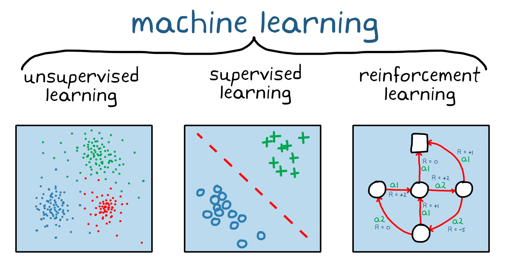
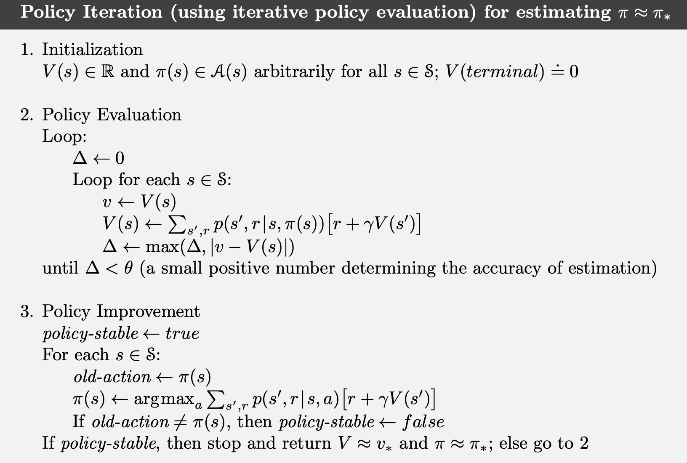
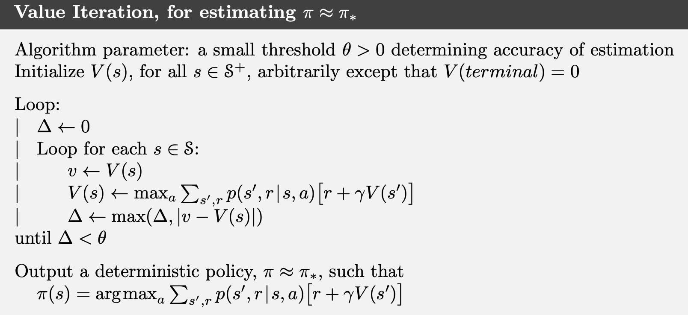

<!-- 

  
  
  

 -->

Estimated Reading Time: 90 min | Author: Jordan Deklerk

<!-- 
 -->
  

    

      Table of Contents
    

    

      <ul>
        <li><a href="#overview" aria-label="Overview">Overview</a></li>
        <li><a href="#markov-decision-processes" aria-label="Markov Decision Processes">Markov Decision Processes</a></li>
        <li><a href="#policy-and-value" aria-label="Policy and Value">Policy and Value</a>
          <ul>
            <li><a href="#policy" aria-label="Policy">Policy</a></li>
            <li><a href="#value-functions" aria-label="Value Functions">Value Functions</a></li>
            <li><a href="#key-terms" aria-label="Key Terms">Key Terms</a></li>
          </ul>
        </li>
        <!-- <li><a href="#a-brief-primer-on-dynamic-programming" aria-label="A Brief Primer on Dynamic Programming">A Brief Primer on Dynamic Programming</a>
          <ul>
            <li><a href="#enter-the-bellman-equation" aria-label="Enter the Bellman Equation">Enter the Bellman Equation</a></li>
            <li><a href="#from-theory-to-practice" aria-label="From Theory to Practice">From Theory to Practice</a></li>
            <li><a href="#solving-bellman-equations" aria-label="Solving Bellman Equations">Solving Bellman Equations</a></li>
          </ul> -->
        </li>
        <li><a href="#bellman-equations-in-reinforcement-learning" aria-label="Bellman Equations in Reinforcement Learning">Bellman Equations in Reinforcement Learning</a>
          <ul>
            <li><a href="#state-occupancy" aria-label="State Occupancy">State Occupancy</a></li>
          </ul>
        </li>
        <li><a href="#bellman-optimality-equations" aria-label="Bellman Optimality Equations">Bellman Optimality Equations</a></li>
        <li><a href="#notes-on-our-setup" aria-label="Notes on Our Setup">Notes on Our Setup</a></li>
          <!-- <ul>
            <li><a href="#policy-iteration" aria-label="Policy Iteration">Policy Iteration</a></li>
            <li><a href="#value-iteration" aria-label="Value Iteration">Value Iteration</a></li>
            <li><a href="#value-iteration" aria-label="Value Iteration">Value Iteration</a></li>
          </ul> -->
        <li><a href="#planning-in-mdps" aria-label="Planning in MDPs">Planning in MDPs</a>
          <ul>
            <li><a href="#policy-iteration" aria-label="Policy Iteration">Policy Iteration</a></li>
            <li><a href="#value-iteration" aria-label="Value Iteration">Value Iteration</a></li>
          </ul>
        </li>
        <li><a href="#conclusion" aria-label="Conclusion">Conclusion</a></li>
      </ul>
    

  

<!-- 
 -->

 
<figure style="text-align: center;">
  
  <!-- <figcaption style="margin-top: 10px; color: gray;">Figure 1: Overview of Reinforcement Learning</figcaption> -->
</figure>
 

## Overview 

<!-- Reinforcement Learning (RL) has emerged as a powerful paradigm in the field of artificial intelligence, driving advancements in everything from robotics to game playing to complex decision-making systems. Unlike traditional supervised learning, where models learn from labeled data, RL involves an agent learning to make decisions by interacting with its environment. This agent takes actions to maximize cumulative rewards, effectively learning from the consequences of its actions. -->

<!-- In recent years, reinforcement learning has garnered significant attention due to its success in high-profile applications such as AlphaGo, self-driving cars, and automated trading systems. These breakthroughs have showcased the potential of RL to solve complex, dynamic problems that were previously thought to be beyond the reach of AI. -->

In this post, we will explore the fundamentals of reinforcement learning from a classical theoretical perspective. The content of this post is heavily based on my notes on a course in Statistical Reinforcement Learning at the University of Illinois Urbana-Champaign. Hopefully they will be helpful for anyone interested in a brief introduction to reinforcement learning.

## Markov Decision Processes 

The overarching goal of RL is to develop algorithms that enable an agent to learn optimal behaviors through trial and error interactions with its environment, without explicit supervision. By balancing exploration of unknown situations with exploitation of known rewarding actions, RL aims to create adaptive systems that can solve complex, dynamic problems across a wide range of domains, from robotics and game playing to resource management and personalized recommendations.

In reinforcement learning, the interactions between an agent and its environment is described by a *Markov decision process*, characterized by:

- State space $\mathcal{S}$. This could be finite or infinite.
- Action space $\mathcal{A}$. This could be finite or infinite.
- Transition function $P: \mathcal{S} \times \mathcal{A} \to \nabla(\mathcal{S})$, where $\nabla(\mathcal{S})$ is the space of probability distributions over the state space $\mathcal{S}$, i.e., the probability simplex. Note that $P(s' | s, a)$ for $s', s \in \mathcal{S}$ and $a \in \mathcal{A}$ is the probability of transitioning into state $s'$ upon taking action $a$ in state $s$.
- Reward function $R: \mathcal{S} \times \mathcal{A} \to [0, R_{\text{max}}]$, where $R_{\text{max}} > 0$ is a constant.
- Discount factor $\gamma \in [0,1)$, which defines a horizon for the problem.

We can write this Markov decision process (MDP) more formally as $\mathcal{M} = (\mathcal{S}, \mathcal{A}, P, R, \gamma)$, where all states in $\mathcal{M}$ have the Markov property. This property says that any future state only depends on the current state and not the entire state history:

$$
P(s_{t+1} | s_1, \dots, s_t) = P(s_{t+1} | s_t), \quad \forall s_t \in \mathcal{S}.
$$

In other words, the future and the past are conditionally independent given the present.

In a given MDP $\mathcal{M}=(\mathcal{S}, \mathcal{A}, P, R, \gamma)$, the agent interacts with the environment according to the following protocol: the agent starts at some state $s_1$; at each time step $t=1,2, \ldots$, the agent takes an action $a_t \in \mathcal{A}$, obtains the immediate reward $r_t=R\left(s_t, a_t\right)$, and observes the next state $s_{t+1}$ sampled from $P\left(s_t, a_t\right)$, or $s_{t+1} \sim P\left(s_t, a_t\right)$. The interaction record

$$
\tau=\left(s_1, a_1, r_1, s_2, \ldots, s_{H+1}\right)
$$

is called a _trajectory_ of length $H$. In some situations, it is necessary to specify how the initial state $s_1$ is generated. We consider $s_1$ sampled from an initial distribution $d_0 \in \Delta(\mathcal{S})$. When $d_0$ is of importance to the discussion, we include it as part of the MDP definition, and write $\mathcal{M}=\left(\mathcal{S}, \mathcal{A}, P, R, \gamma, d_0\right)$.

## Policy and Value 

In reinforcement learning, we often talk about policies and value functions. These are fundamental concepts that help us understand how an agent makes decisions and evaluates the quality of those decisions.

### Policy

A policy, denoted as $\pi$, is a decision-making strategy that an agent uses to choose actions in different states. We can have two types of policies:

1. **Deterministic policy**: Here $\pi: \mathcal{S} \to \mathcal{A}$, i.e., for each state $s$, it tells the agent exactly which action $a$ to take, i.e., $a_t = \pi(s_t)$.

2. **Stochastic policy**: Here $\pi: \mathcal{S} \to \nabla (\mathcal{A})$, i.e., instead of dictating a single action, it gives a probability distribution over possible actions for each state, $a_t \sim \pi(s_t)$, where $a$ is drawn from the distribution $\pi(s), \, \forall s \in \mathcal{S}$.

The ultimate goal of our agent is to find a policy that maximizes the expected total reward over time. We call this total reward the value. Mathematically, we express this as:

$$
\textcolor{#c85417}{\mathbb{E}\bigg[\sum_{t=1}^{\infty} \gamma^{t-1}  r_t | \pi, s_1 \bigg]},
$$

where $r_t$ is the reward at time $t$, $\gamma$ is a discount factor that makes future rewards less valuable than immediate ones, and $s_1$ is the starting state. The expectation considers all possible trajectories the agent might follow under the policy $\pi$.

It's worth noting that this sum of rewards is always bounded. Since each reward $r_t$ is between 0 and some maximum value $R_{max}$, the total discounted reward is always between 0 and $R_{max} / (1-\gamma)$. This upper bound is crucial for analyzing the performance of learning algorithms.

### Value Functions

Now, let's talk about value functions. These are tools we use to evaluate how good a policy is. We have two main value functions that are crucial for reinforcement learning:

1. **State-value function** $\textcolor{#DC143C}{V_{\mathcal{M}}^\pi(s)}$: This tells us the expected total reward if we start in state $s$ and follow policy $\pi$ thereafter:

   $$
   \begin{align}
   \textcolor{#DC143C}{V_{\mathcal{M}}^\pi(s) = \mathbb{E}\bigg[\sum_{t=1}^{\infty} \gamma^{t-1} r_t | \pi, s_1 = s\bigg]}.
   \end{align}
   $$

2. **Action-value function** $\textcolor{#1E90FF}{Q_{\mathcal{M}}^\pi(s,a)}$: This is similar, but it considers what happens if we start in state $s$, take a specific action $a$, and then follow policy $\pi$ thereafter:

   $$
   \begin{align}
   \textcolor{#1E90FF}{Q_{\mathcal{M}}^\pi(s,a) = \mathbb{E}\bigg[\sum_{t=1}^{\infty} \gamma^{t-1} r_t | \pi, s_1 = s, a_1 = a\bigg]}.
   \end{align}
   $$

These value functions are incredibly useful. They allow us to compare different policies and make informed decisions about which actions to take in each state. The goal of many reinforcement learning algorithms is to estimate these value functions accurately and use them to find an optimal policy.

Note that moving forward we will drop the notation depending on $\mathcal{M}$, and it will be made explicit whenever necessary.

### Key Terms 

Below are some important terms you will encounter a lot when reading papers about reinforcement learning:

#### <u>Model-free reinforcement learning</u>

Model-free reinforcement learning is an approach where the agent learns to make optimal decisions through direct experience, without explicitly modeling the environment's dynamics. Instead of trying to understand how the environment works, the agent focuses on learning which actions lead to the best outcomes based on trial and error.

#### <u>Model-based reinforcement learning</u>

Model-based reinforcement learning involves methods where the agent learns an explicit model of the environment, including how states transition and how rewards are generated. The agent then uses this model to plan and make decisions.

#### <u>On-policy learning</u>

On-policy learning refers to methods where the agent learns about and improves the same policy that it's currently using to make decisions. In other words, the policy being evaluated is the same as the policy being improved.

#### <u>Off-policy learning</u>

Off-policy learning involves methods where the agent learns about a target policy while following a different behavior policy. This decoupling allows the agent to learn from a wider range of experiences, including those generated by other policies or from historical data.

## Bellman Equations in Reinforcement Learning 

Assume that our state-space $\mathcal{S}$ is finite and that we have a deterministic policy $\pi$. These assumptions will simplify some of the mathematical representations we are going to introduce, but everything that follows also holds for an infinite $\mathcal{S}$ and stochastic policy $\pi$, albeit with slight adjustments.

In reinforcement learning, we're often trying to figure out how good a policy is, and in particular, one that is optimal. We do this by estimating the value functions from the previous section, which tell us the expected future rewards when following a particular policy. Recall that

1. The state-value function $\textcolor{#DC143C}{V^\pi(s)}$: This tells us how good it is to be in a state $s$ when following policy $\pi$.
2. The action-value function $\textcolor{#1E90FF}{Q^\pi(s,a)}$: This tells us how good it is to take action $a$ in state $s$, and then follow policy $\pi$ afterwards.

Again, our ultimate goal is to find the optimal policy $\pi^*$ that maximizes the value function, i.e.,
$$
V^*(s)=\max _\pi V^\pi(s)
$$

To derive the Bellman equations for policy evaluation, we start by considering the expected discounted sum of rewards (or value) under a policy $\pi$ as described in Equations 1 and 2. 

#### <u>Bellman Equation for the State-Value Function</u>

By the definition of the state-value function $V^\pi(s)$ we have

$$
V^\pi(s) = \mathbb{E} \left[ \sum_{t=1}^{\infty} \gamma^{t-1} r_t \mid \pi, s_1 = s \right].
$$

We can break down the sum into the first reward plus the discounted future rewards as

$$
V^\pi(s) = \mathbb{E} \left[ r_1 + \gamma \sum_{t=2}^{\infty} \gamma^{t-2} r_t \mid \pi, s_1 = s \right].
$$

Here, we use the law of total expectation to separate the immediate reward from future rewards. The first reward $r_1$ is received immediately upon taking action $a_1$ given by policy $\pi$ in state $s$. Hence,

$$
V^\pi(s) = \mathbb{E} \left[ r_1 \mid \pi, s_1 = s \right] + \gamma \mathbb{E} \left[ \sum_{t=2}^{\infty} \gamma^{t-2} r_t \mid \pi, s_1 = s \right].
$$

Let’s denote $s'$ as the next state. Because the policy $\pi$ chooses an action $a = \pi(s)$ and the reward $r_1 = R(s, a)$, we get

$$
V^\pi(s) = R(s, \pi(s)) + \gamma \mathbb{E} \left[ \sum_{t=2}^{\infty} \gamma^{t-2} r_t \mid \pi, s_1 = s \right].
$$

The term inside the expectation of the second part is the value function at the next state $s'$ at time step 2 and beyond, discounted by $\gamma$, given by

$$
V^\pi(s) = R(s, \pi(s)) + \gamma \mathbb{E} \left[ V^\pi(s') \mid s_1 = s \right].
$$

Since the transition from state $s$ to state $s'$ follows the transition probability $P(s' \mid s, \pi(s))$, we have

$$
V^\pi(s) = R(s, \pi(s)) + \gamma \sum_{s'} P(s' \mid s, \pi(s)) V^\pi(s').
$$

Therefore,

$$
\textcolor{#DC143C}{V^\pi(s) = R(s, \pi(s)) + \gamma \mathbb{E}_{s' \sim P(\cdot \mid s, \pi(s))} \left[V^\pi(s') \right]}.
$$

#### <u>Bellman Equation for the Action-Value Function</u>

Recall the definition of the action-value function $Q^\pi(s, a)$ in Equation 2 given by

$$
Q^\pi(s, a) = \mathbb{E} \left[ \sum_{t=1}^{\infty} \gamma^{t-1} r_t \mid \pi, s_1 = s, a_1 = a \right].
$$

We can similarly break down the sum into the first reward plus the discounted future rewards:

$$
Q^\pi(s, a) = \mathbb{E} \left[ r_1 + \gamma \sum_{t=2}^{\infty} \gamma^{t-2} r_t \mid \pi, s_1 = s, a_1 = a \right].
$$

Given that the first reward $r_1 = R(s, a)$, we have

$$
Q^\pi(s, a) = R(s, a) + \gamma \mathbb{E} \left[ \sum_{t=2}^{\infty} \gamma^{t-2} r_t \mid \pi, s_1 = s, a_1 = a \right].
$$

Let’s denote $s'$ as the state at time step $2$ as previously. Then we have

$$
Q^\pi(s, a) = R(s, a) + \gamma \mathbb{E} \left[ V^\pi(s') \mid s_1 = s, a_1 = a \right].
$$

Since the transition from state $s$ to state $s'$ follows the transition probability $P(s' \mid s, a)$, we get

$$
Q^\pi(s, a) = R(s, a) + \gamma \sum_{s'} P(s' \mid s, a) V^\pi(s').
$$

Therefore,

$$
\textcolor{#1E90FF}{Q^\pi(s, a) = R(s, a) + \gamma \mathbb{E}_{s' \sim P(\cdot \mid s, a)} \left[ V^\pi(s') \right]}.
$$

Combining the above results, we obtain the **Bellman equations** for policy evaluation as

$$
\begin{equation}
\begin{aligned}
\textcolor{#DC143C}{V^\pi(s)} &\textcolor{#DC143C}{=} \textcolor{#DC143C}{Q^\pi(s, \pi(s))}, \\
\textcolor{#1E90FF}{Q^\pi(s, a)} &\textcolor{#1E90FF}{=} \textcolor{#1E90FF}{R(s, a)+\gamma \mathbb{E}_{s^{\prime} \sim P(s, a)}\left[V^\pi\left(s^{\prime}\right)\right]} .
\end{aligned}
\end{equation}
$$

The first equation is saying that the value of being in state $s$ is the same as the value of taking the action that our policy would choose in that state. The second equation is saying that the value of taking action $a$ in state $s$ is equal to the immediate reward we get, plus the discounted value of where we might end up next.

In many reinforcement learning problems, we're dealing with a finite number of states and actions. This means we can represent our value functions as vectors, and our transition probabilities as matrices. In particular, since we assume that $\mathcal{S}$ is finite, we can treat $V^{\pi}$ and any distribution over $\mathcal{S}$ as vectors in $\mathbb{R}^{|S|}$, and $R$ and $Q^{\pi}$ as vectors in $\mathbb{R}^{|\mathcal{S} \times \mathcal{A}|}$. This allows use to re-write Eq. 1 in a matrix-vector format and derive analytical solutions for $V^{\pi}$, which we will do below.

We can define a transition matrix $P^\pi$ which tells us the probability of moving from one state to another under our policy

$$
\left[P^\pi\right]_{s, s^{\prime}}=\mathbb{E}_{a \sim \pi(s)}\left[P\left(s^{\prime} \mid s, a\right)\right] .
$$

Also we can define a reward vector $R^\pi$ that tells us the expected immediate reward for each state under our policy

$$
\left[R^\pi\right]_s=\mathbb{E}_{a \sim \pi(s)}[R(s, a)] .
$$

With these, we can rewrite our Bellman equation for $V^\pi$ in a more compact form as

$$
\begin{aligned}
{\left[V^\pi\right]_s} & =\left[R^\pi\right]_s+\gamma \mathbb{E}_{s^{\prime} \sim P(s, \pi)}\left[V^\pi\left(s^{\prime}\right)\right] \\
& =\left[R^\pi\right]_s+\gamma\left\langle P(s, \pi), V^\pi\right\rangle.
\end{aligned}
$$

This last line is particularly neat. It's saying that the value of a state is equal to the immediate reward plus the dot product of the transition probabilities and the values of all possible next states. Since this equation holds for every $s \in \mathcal{S}$, we have

$$
V^\pi=R^\pi+\gamma P^\pi V^\pi \quad \Rightarrow \quad\left(\mathbf{I}_{|\mathcal{S}|}-\gamma P^\pi\right) V^\pi=R^\pi,
$$

where $\mathbf{I}_{|\mathcal{S}|}$ is the identity matrix. Now we notice that matrix $\left(\mathbf{I}_{|\mathcal{S}|}-\gamma P^\pi\right)$ is always invertible. In fact, for any non-zero vector $x \in \mathbb{R}^{|\mathcal{S}|}$,

$$
\begin{aligned}
\left\|\left(\mathbf{I}_{|\mathcal{S}|}-\gamma P^\pi\right) x\right\|_{\infty} &= \left\|x-\gamma P^\pi x\right\|_{\infty} \\
&\geq \|x\|_{\infty}-\gamma\left\|P^\pi x\right\|_{\infty} & \text{(triangular inequality for norms)} \\
&\geq \|x\|_{\infty}-\gamma\|x\|_{\infty} & \text{(each element of } P^\pi x \text{ is a convex average of } x \text{)} \\
&= (1-\gamma)\|x\|_{\infty} > 0 & (\gamma < 1, x \neq \mathbf{0})
\end{aligned}
$$

So we can conclude that

$$
\begin{equation}
V^\pi=\left(\mathbf{I}_{|\mathcal{S}|}-\gamma P^\pi\right)^{-1} R^\pi .
\end{equation}
$$

### State Occupancy 

When we're dealing with reinforcement learning problems where the reward only depends on the current state i.e., $R(s, a) = R(s)$, we stumble upon an interesting property of value functions. The value of a policy can be expressed as a linear combination of rewards

$$
V^\pi = (\mathbf{I}_{|\mathcal{S}|} - \gamma P^\pi)^{-1} R^\pi.
$$

This is telling us something quite intuitive. The value of a policy isn't just about immediate rewards; it's about how often we visit each state and the rewards associated with those states.

<u>**What is State Occupancy?**</u>

The term $(\mathbf{I}_{|\mathcal{S}|} - \gamma P^\pi)^{-1}$ in our equation above is what we call the "state occupancy". Think of it as a measure of how much time we spend in each state when following our policy π. More precisely:

1. It's the expected number of times we visit each state.
2. Later visits are discounted more heavily (that's where $\gamma$ comes in).
3. We usually normalize it by multiplying by $(1-\gamma)$ to get what we call the "normalized state occupancy", $d^{\pi, s}$.

<u>**Another Way to Think About It**</u>

We can also define state occupancy as

$$
d^{\pi, s} = (1-\gamma) \sum_{t=1}^{\infty} \gamma^{t-1} d_t^{\pi, s}.
$$

Here, $d_t^{\pi, s}(s')$ is the probability of being in state $s'$ at time $t$ if we start in state $s$ and follow policy π. This definition really hammers home the idea that state occupancy is about the long-term visitation patterns under our policy.

We can extend this idea to state-action pairs too. Instead of just looking at how often we visit states, we can look at how often we take specific actions in specific states. We often use the same notation $d^\pi$ for this, relying on context to make clear whether we mean state occupancy or state-action occupancy.

<u>**Why Does This Matter?**</u>

State occupancy is a powerful concept because it helps us understand the long-term behavior of our policy. It's not just about where we are now, but where we're likely to end up over time. This can be crucial for several reasons:

1. Policy evaluation: Understanding how good our current policy is.
2. Policy improvement: Figuring out how to make our policy better.
3. Reward design: If we're designing rewards for a task, understanding state occupancy can help us create more effective reward structures.

In essence, state occupancy gives us a bird's eye view of our policy's behavior, helping us make more informed decisions in our reinforcement learning algorithms.

## Bellman Optimality Equations 

In reinforcement learning, remarkably, there always exists an optimal policy that maximizes both the state value function $V^\pi(s)$ for all states $s \in \mathcal{S}$ and the action-value function $Q^\pi(s, a)$ for all state-action pairs $(s, a) \in \mathcal{S} \times \mathcal{A}$. This optimal policy is stationary and deterministic, denoted as $\pi_M^{*}$ or simply $\pi^{*}$. We use $V^{*}$ and $Q^{*}$ as shorthand notations for the optimal value functions $V^{\pi^{*}}$ and $Q^{\pi^{*}}$, respectively. We have the following theorem that establishes this.

Theorem 1. (Optimal Policy Existence)

For any Markov Decision Process $\mathcal{M} = (\mathcal{S}, \mathcal{A}, P, R, \gamma)$:

- There exists an optimal policy $\pi_*$, i.e., there exists a policy $\pi_*$ such that $V_{\pi_*}(s) \geq V_\pi(s)$ for all policies $\pi$ and $\forall s \in \mathcal{S}$.
- All optimal policies achieve the optimal value function, i.e., $V_{\pi_*}(s)=$ $V_*(s)$ for all $s \in \mathcal{S}$, for all optimal policies $\pi_*$.
- All optimal policies achieve the optimal action-value function, i.e., $Q_{\pi_*}(s, a)=$ $Q_*(s, a)$ for all $s \in \mathcal{S}$, for all $a \in \mathcal{A}$, for all optimal policies $\pi_*$.

<!-- The following proof is taken from [here](https://web.stanford.edu/class/cme241/lecture_slides/OptimalPolicyExistence.pdf). -->

Proof of Theorem 1

First we establish a simple Lemma.

**Lemma 1.** For any two Optimal Policies $\pi_1$ and $\pi_2, V_{\pi_1}(s)=V_{\pi_2}(s)$ for all $s \in \mathcal{S}$.

**Proof.** Since $\pi_1$ is an optimal policy, we have that $V_{\pi_1}(s) \geq V_{\pi_2}(s)$ for all $s \in \mathcal{S}$. Likewise, since $\pi_2$ is an optimal policy, we have $V_{\pi_2}(s) \geq V_{\pi_1}(s)$ for all $s \in \mathcal{S}$. This implies that $V_{\pi_1}(s)=V_{\pi_2}(s)$ for all $s \in \mathcal{S}$.  $\blacksquare$

As a consequence of Lemma 1, all we need to do to prove the theorem is to establish an optimal policy $\pi_*$ that achieves the optimal value Function and the optimal action-value function. Consider the following deterministic policy (as a candidate optimal policy) $\pi_*: \mathcal{S} \rightarrow \mathcal{A}$ :

$$
\pi_*(s)=\underset{a \in \mathcal{A}}{\arg \max } \, Q_*(s, a), \quad \forall s \in \mathcal{S}.
$$

First we show that $\pi_*$ achieves the optimal value function. Since $\pi_*(s)=$ $\arg \max _{a \in \mathcal{A}} Q_*(s, a)$ and $V_*(s)=\max _{a \in \mathcal{A}} Q_*(s, a)$ for all $s \in \mathcal{S}, \pi_*$ prescribes the optimal action for each state (that produces the optimal value function $V_*$). Hence, following policy $\pi_*$ in each state will generate the same value function as the optimal value function. In other words, $V_{\pi_*}(s)=V_*(s)$ for all $s \in \mathcal{S}$. Likewise, we can argue that $Q_{\pi_*}(s, a)=Q_*(s, a)$ for all $s \in \mathcal{S}$ and for all $a \in \mathcal{A}$.

Finally, we prove by contradiction that $\pi_*$ is an optimal policy. So assume $\pi_*$ is not an optimal policy. Then there exists a policy $\pi$ and a state $s \in \mathcal{S}$ such that $V_\pi(s)>V_{\pi_*}(s)$. Since $V_{\pi_*}(s)=V_*(s)$, we have that $V_\pi(s)>V_*(s)$, which contradicts the definition of $V_*(s)=\max _\pi V_\pi(s)$.  $\blacksquare$

 

The optimal value functions $V^{\star}$ and $Q^{\star}$ satisfy the **Bellman optimality equations**, which are defined as follows for all states $s \in \mathcal{S}$ and actions $a \in \mathcal{A}$:

$$
\begin{equation}
\begin{aligned}
\textcolor{#DC143C}{V^{\star}(s)} &\textcolor{#DC143C}{=} \textcolor{#DC143C}{\max_{a \in \mathcal{A}} Q^{\star}(s, a)}, \\
\textcolor{#1E90FF}{Q^{\star}(s, a)} &\textcolor{#1E90FF}{=} \textcolor{#1E90FF}{R(s, a) + \gamma \mathbb{E}_{s' \sim P(s, a)}[V^{\star}(s')]}.
\end{aligned}
\end{equation}
$$

Once we have determined $Q^{\star}$, we can derive the optimal policy $\pi^{\star}$ by selecting actions greedily

$$
\begin{equation}
\textcolor{#c85417}{\pi^{\star}(s) = \underset{a \in \mathcal{A}}{\arg \max} \, Q^{\star}(s, a)}, \textcolor{#c85417}{\quad \forall s \in \mathcal{S}}.
\end{equation}
$$

We use $\pi_Q$ to denote the process of converting a $Q$-value function into its corresponding greedy policy. Thus, we can express the optimal policy as

$$
\textcolor{#c85417}{\pi^{\star} = \pi_{Q^{\star}}}
$$

To facilitate further discussion, we introduce the Bellman optimality operator $\mathcal{T}_M: \mathbb{R}^{|\mathcal{S} \times \mathcal{A}|} \rightarrow \mathbb{R}^{|\mathcal{S} \times \mathcal{A}|}$ (or simply $\mathcal{T}$). When applied to a vector $f \in \mathbb{R}^{|\mathcal{S} \times \mathcal{A}|}$, this operator is defined as:

$$
\textcolor{#c85417}{(\mathcal{T}f)(s, a) := R(s, a) + \gamma \langle P(s, a), V_f \rangle},
$$

where $V_f(\cdot) := \max_{a \in \mathcal{A}} f(\cdot, a)$.

Using this operator, we can rewrite the Bellman optimality equation for $Q^{\star}$ in Equation 5 in a concise form:

$$
\textcolor{#c85417}{Q^{\star} = \mathcal{T}Q^{\star}}.
$$

This equation implies that $Q^{\star}$ is the fixed point of the operator $\mathcal{T}$.

## Notes on Our Setup 

Before exploring classical methods for solving reinforcement learning problems, let's consider some alternative configurations of the environment we've set up.

#### <u>Finite Horizon and Episodic Setting</u> 

Our value function typically applies to the infinite-horizon discounted setting of Markov Decision Processes (MDPs). However, other common settings include the finite-horizon un-discounted setting, where the return from a trajectory is expressed as $\sum_{t=1}^H r_t$ for a predefined finite horizon $H \le \infty$, and the infinite-horizon average reward setting, described by $\lim_{T \rightarrow \infty} \frac{1}{T} \sum_{t=1}^T r_t$. This latter setting often necessitates additional assumptions about transition dynamics, such as ergodicity, to ensure well-defined values.

To incorporate the finite-horizon un-discounted setting within a discounted framework, we expand the state space. For an MDP $\mathcal{M}$ with a finite horizon $H$, we define a new MDP $\tilde{\mathcal{M}} = (\tilde{\mathcal{S}}, \mathcal{A}, \tilde{P}, \tilde{R}, \gamma)$, where 

$$
\tilde{\mathcal{S}} = \mathcal{S} \times [H] \cup \{s_{\text{absorbing}}\} \quad \text{and} \quad [H] = \{1, \ldots, H\}.
$$

This setup essentially duplicates the state space $H$ times, organizing it into levels, and adds an absorbing state $s_{\text{absorbing}}$, where all actions lead back to itself and yield a reward of 0. There is only a non-zero transition probability from states at level $h$ to states at level $h+1$ with $\tilde{P}\left((s', h+1) | (s, h), a\right) = P(s' | s, a)$, and states at the final level $(s, H)$ transition deterministically to $s_{\text{absorbing}}$. We define $\tilde{R}((s, h), a) = R(s, a)$ and set $\gamma = 1$. Typically, $\gamma = 1$ might lead to infinite values, but in this structure, the agent transitions to the absorbing state after $H$ steps, securing finite total rewards. Optimal policies for finite-horizon MDPs are usually non-stationary, meaning they depend on both the state $s$ and the time step $h$.

This structured MDP typifies episodic tasks where the environment shifts deterministically to an absorbing state after a fixed number of steps. The absorbing state usually signifies the endpoint of an episode, and many scenarios naturally fit this episodic framework, like board games (which end when a winner is decided) and dialogue systems (which conclude when the conversation finishes).

#### <u>Stochastic rewards</u> 

Our setup assumes that reward $r_t$ only depends on $s_t$ and $a_t$ deterministically. In general, $r_t$ may also depend on $s_{t+1}$ and contain additional noise that is independent from state transitions as well as reward noise in other time steps. As special cases, in inverse RL literature, reward only depends on state, and in contextual bandit literature, reward depends on the state (or context in bandit terminologies) and action, but has additional independent noise.

All these setups are equivalent to having a state-action reward with regard to the policy values: define 

$$
R(s, a)=\mathbb{E}\left[r_t \mid s_t=s, a_t=a\right],
$$ 

where $s_{t+1}$ and the independent noise are marginalized out. The value functions $V^\pi$ and $Q^\pi$ for any $\pi$ remains the same when we substitute in this equivalent reward function. That said, reward randomness may introduce additional noise in the sample trajectories and affect learning efficiency.

#### <u>Negative rewards</u> 

Our setup assumes that $r_t \in\left[0, R_{\max }\right]$. This is without loss of generality in the infinite-horizon discounted setting: for any constant $c>0$, a reward function $R \in \mathbb{R}^{|\mathcal{S} \times \mathcal{A}|}$ is equivalent to $R+c \mathbf{1}_{|\mathcal{S} \times \mathcal{A}|}$, as adding $c$ units of reward to each state-action pair simply adds a constant "background" value of $c /(1-\gamma)$ to the value of all policies for all initial states. Therefore, when the rewards may be negative but still have bounded range, e.g., $R(s, a) \in[-a, b]$ with $a, b>0$, we can add a constant offset $c=a$ to the reward function and define $R_{\max }=a+b$, so that after adding the offset the reward lies in $\left[0, R_{\max }\right]$.

## Planning in MDPs 

Now we are ready to discuss how to solve RL problems. _Planning_ refers to the problem of computing the optimal policy $\pi^*_{\mathcal{M}}$ given the MDP specification $\mathcal{M} = (\mathcal{S}, \mathcal{A}, P, R, \gamma)$ using dynamic programming. We will focus on several classical planning algorithms that compute $Q^*_{\mathcal{M}}$ such as policy and value iteration. 

The term dynamic programming refers to a collection of algorithms that can be used to compute optimal policies given a perfect model of the environment as a Markov decision process (MDP). Keep in mind that classical DP algorithms are of limited utility in reinforcement learning both because of their assumption of a perfect model and because of their great computational expense, but they are still important theoretically. 

DP provides an essential foundation for understanding the methods underlying many modern RL algorithms. In fact, all of these modern methods can be viewed as attempts to achieve much of the same effect as DP, only with less computation and without assuming a perfect model of the environment.

### Policy Iteration 

Policy iteration is an algorithm that begins with an arbitrary initial policy $\pi_0$ and repeatedly performs the following steps for $k=1,2,\ldots$

$$
\pi_k=\pi_{Q^{\pi_{k-1}}}.
$$

In each iteration of this process, we first calculate the $Q$-value function for the policy $\pi_{k-1}$. Using this $Q$-value function, we then determine the next policy, $\pi_k$, which is the greedy policy derived from the $Q$-values. This process involves two main steps:

- **Policy Evaluation:** Computing the $Q$-value function of $\pi_{k-1}$.
- **Policy Improvement:** Deriving a greedy policy that maximizes the $Q$-values.

The policy's performance is guaranteed to improve monotonically across all states until the optimal policy $\pi^{*}$ is reached.

Theorem 2. (Policy Improvement)

In Policy iteration, the value function $V^{\pi_k}(s)$ for policy $\pi_k$ is always greater than or equal to the value function $V^{\pi_{k-1}}(s)$ for all states $s \in \mathcal{S}$ and actions $a \in \mathcal{A}$, starting from $k \geq 1$. The improvement is strictly positive for at least one state until the optimal policy $\pi^{\star}$ is achieved.

Thus, policy iteration ends when the $Q$-values for consecutive policies are identical, i.e., $Q^{\pi_k} = Q^{\pi_{k-1}}$. The algorithm typically terminates in $|\mathcal{A}|^{|\mathcal{S}|}$ iterations, given that it explores stationary and deterministic policies.

To prove Theorem 2, we need to introduce an important concept called _advantage_.

Definition 1. (Advantage)

The advantage of taking action $a$ in state $s$ under policy $\pi$ is defined as

$$
A^\pi(s, a) := Q^\pi(s, a) - V^\pi(s).
$$

The advantage measures how much better (or worse) it is to take a specific action over the default policy action. The advantage of a new policy $\pi'$ over an old policy $\pi$ is defined as

$$
A^\pi(s, \pi') := A^\pi(s, \pi'(s)).
$$

Since policy iteration always adopts the greedy policy based on the current $Q$-values, the advantage of the new policy over the old is always non-negative.

Proposition 1. (Performance Difference Lemma)

The difference in value functions between any two policies $\pi$ and $\pi'$ for any state $s$ can be expressed as

$$
V^{\pi'}(s) - V^\pi(s) = \frac{1}{1-\gamma} \mathbb{E}_{s' \sim d^{\pi', s}}\left[A^\pi(s', \pi')\right],
$$

where $d^{\pi', s}$ is the normalized discounted occupancy induced by policy $\pi'$ from the starting state $s$.

Proof of Proposition 1

Consider a sequence of (potentially non-stationary) policies $\left\{\pi_i\right\}_{i \geq 0}$, where $\pi_0=\pi, \pi_{\infty}=\pi^{\prime}$. For any intermediate $i, \pi_i$ is the non-stationary policy that follows $\pi^{\prime}$ for the first $i$ time-steps and switches to $\pi$ for the remainder of the trajectory. Now we can rewrite the LHS of the statement as:

$$
V^{\pi^{\prime}}(s)-V^\pi(s)=\sum_{i=0}^{\infty}\left(V^{\pi_{i+1}}(s)-V^{\pi_i}(s)\right) .
$$

For each term on the RHS, observe that $\pi_i$ and $\pi_{i+1}$ share the same "roll-in" policy $\pi^{\prime}$ for the first $i$ steps, which defines a roll-in distribution $\mathbb{P}\left[s_{i+1} \mid s_1=s, \pi^{\prime}\right]$. They also share the same "roll-out" policy $\pi$ starting from the $(i+2)$-th time step, so conditioned on $s_{i+1}=s, a_{i+1}=a$, the total expected reward picked up in the remainder of the trajectory is $\gamma^i Q^\pi(s, a)$ for both $\pi_i$ and $\pi_{i+1}$. Putting together, we have

$$
\begin{aligned}
V^{\pi^{\prime}}(s)-V^\pi(s) & =\sum_{i=0}^{\infty} \gamma^i \sum_{s^{\prime} \in \mathcal{S}} \mathbb{P}\left[s_{i+1}=s^{\prime} \mid s_1=s, \pi^{\prime}\right]\left(Q^\pi\left(s^{\prime}, \pi^{\prime}\left(s^{\prime}\right)\right)-Q^\pi\left(s^{\prime}, \pi\left(s^{\prime}\right)\right)\right) \\
& =\sum_{i=0}^{\infty} \gamma^i \sum_{s^{\prime} \in \mathcal{S}} \mathbb{P}\left[s_{i+1}=s^{\prime} \mid s_1=s, \pi^{\prime}\right] A^\pi\left(s^{\prime}, \pi^{\prime}\right) .
\end{aligned}
$$

The result follows by noticing that $\sum_{i=0}^{\infty} \gamma^i \mathbb{P}\left[s_{i+1}=s^{\prime} \mid s_1=s, \pi^{\prime}\right]=\frac{1}{1-\gamma} d^{\pi^{\prime}, s}\left(s^{\prime}\right)$.  $\blacksquare$

Now we can prove Theorem 2 using the definition of advantage and the _performance difference lemma_.

Proof of Theorem 2

Invoke the performance difference lemma on $\pi^{\prime}=\pi_{k+1}$ and note that $\pi=\pi_k$, and that $V^{\pi_{k+1}} \geq V^{\pi_k}$ follows immediately by observing that $A^{\pi_k}\left(s, \pi_{k+1}\right)$ is non-negative in every state. The strict improvement part follows by realizing that $A^{\pi_k}\left(s, \pi_{k+1}\right)$ must be strictly positive in some state $s_0$, otherwise $\pi_k=\pi^{\star}$.

In this case, $V^{\pi_{k+1}}\left(s_0\right)>V^{\pi_k}\left(s_0\right)$, because decomposing their difference using the performance difference lemma reveals that the difference contains $A^{\pi_k}\left(s_0, \pi_{k+1}\right)$ (since the point mass on $s_0$ is "contained" in $d^{\pi_{k+1}, s_0}$ ), which is strictly positive.  $\blacksquare$

Policy iteration typically converges quickly in practice for tabular problems, but its theoretical properties are not entirely well-defined. We know that the number of iterations is capped by $|\mathcal{A}|^{|\mathcal{S}|}$, and in the worst case, some algorithm variants can exhibit exponential computational complexity. However, we usually seek an approximate solution, and it can be demonstrated that policy iteration also benefits from exponential convergence, a fact that is not widely recognized.

Theorem 3. (Policy iteration enjoys exponential convergence)

$$
\left\|Q^{\star}-Q^{\pi_{k+1}}\right\|_{\infty} \leq \gamma\left\|Q^{\star}-Q^{\pi_k}\right\|_{\infty}.
$$

Proof of Theorem 3

We will use two facts and the Bellman operator $\mathcal{T}_{\mathcal{M}}$ from earlier:

- (a) $\mathcal{T}^{\pi_{k+1}} Q^{\pi_k} \geq \mathcal{T}^\pi Q^{\pi_k}, \, \forall \pi$,
- (b) $\mathcal{T}^{\pi_{k+1}} Q^{\pi_k} \leq Q^{\pi_{k+1}}$.
  Here " $\leq$ " and " $\geq$ " are element-wise, and we will verify (a) and (b) at the end of this proof. Given (a) and (b), we have

$$
Q^{\star}-Q^{\pi_{k+1}}=\left(Q^{\star}-\mathcal{T}^{\pi_{k+1}} Q^{\pi_k}\right)+\left(\mathcal{T}^{\pi_{k+1}} Q^{\pi_k}-Q^{\pi_{k+1}}\right) \leq \mathcal{T}^{\pi^{\star}} Q^{\star}-\mathcal{T}^{\pi^{\star}} Q^{\pi_k} .
$$

The first step just adds and subtracts the same quantity. The second step applies (a) and (b) to the two parentheses, respectively. Now

$$
\begin{array}{rlr}
\left\|Q^{\star}-Q^{\pi_{k+1}}\right\|_{\infty} & \leq\left\|\mathcal{T}^{\pi^{\star}} Q^{\star}-\mathcal{T}^{\pi^{\star}} Q^{\pi_k}\right\|_{\infty} & \left(Q^{\star}-Q^{\pi_{k+1}}\right. \text { is non-negative) } \\
& \leq \gamma\left\|Q^{\star}-Q^{\pi_k}\right\|_{\infty} & \left(\mathcal{T}^\pi \text { is a } \gamma \text {-contraction for any } \pi\right)
\end{array}
$$

Finally we verify (a) and (b) by noting that

$$
\begin{align}
\left(\mathcal{T}^{\pi_{k+1}} Q^{\pi_k}\right)(s, a) &= \mathbb{E}\left[\sum_{h=1}^{\infty} \gamma^{h-1} r_h \mid s_1=s, a_1=a, a_2 \sim \pi_{k+1}, a_{3: \infty} \sim \pi_k\right], \\
\left(\mathcal{T}^\pi Q^{\pi_k}\right)(s, a) &= \mathbb{E}\left[\sum_{h=1}^{\infty} \gamma^{h-1} r_h \mid s_1=s, a_1=a, a_2 \sim \pi, a_{3: \infty} \sim \pi_k\right], \\
Q^{\pi_{k+1}}(s, a) &= \mathbb{E}\left[\sum_{h=1}^{\infty} \gamma^{h-1} r_h \mid s_1=s, a_1=a, a_2 \sim \pi_{k+1}, a_{3: \infty} \sim \pi_{k+1}\right].
\end{align}
$$

where $a_{3: \infty}$ denote all the actions from the 3rd time step onwards, and $a_h \sim \pi$ is a shorthand for $a_h=\pi\left(s_h\right)$. Since $\pi_{k+1}$ greedily optimizes $Q^{\pi_k}$, $(5) \geq (6)$ and (a) follows. (b) follows due to the policy improvement theorem, i.e., $(7) \geq(5)$ because $\pi_{k+1}$ outperforms $\pi_k$ in all states.  $\blacksquare$

 

 

### Value Iteration 

Value iteration is a method used to approximate the optimal action-value function $Q^\star$ directly, without alternating between value functions and policies as in policy iteration. The process starts with an initial value function $Q^{\star, 0}$, often initialized to zero for all state-action pairs. The algorithm then iteratively computes $Q^{\star, h}$ for each iteration $h = 1, 2, \ldots, H$ 
$$
Q^{\star, h} = \mathcal{T} Q^{\star, h-1}.
$$

Here, $\mathcal{T}$ is defined as the Bellman optimality operator from before. The algorithm continues until $Q^{\star, H}$ is sufficiently close to $Q^\star$, ensuring minimal sub-optimality when acting greedily based on the approximate $Q$-value function $f$.

Lemma 2. (Sub-optimality Bound)

The following bounds the sub-optimality of the value function derived from an approximate $Q$-value function $f$:

$$
\left\| V^\star - V^{\pi_f} \right\|_\infty \leq \frac{2 \left\| f - Q^\star \right\|_\infty }{1 - \gamma}.
$$

Proof of Lemma 2

For any state $s \in \mathcal{S}$, we have

$$
\begin{aligned}
V^\star(s) - V^{\pi_f}(s) &= Q^\star(s, \pi^\star(s)) - Q^\star(s, \pi_f(s)) + Q^\star(s, \pi_f(s)) - Q^{\pi_f}(s, \pi_f(s)) \\
&\leq Q^\star(s, \pi^\star(s)) - f(s, \pi^\star(s)) + f(s, \pi_f(s)) - Q^\star(s, \pi_f(s)) \\
& \quad \quad + \gamma \mathbb{E}_{s' \sim P(s, \pi_f(s))} \left[ V^\star(s') - V^{\pi_f}(s') \right] \\
&\leq 2 \left\| f - Q^\star \right\|_\infty + \gamma \left\| V^\star - V^{\pi_f} \right\|_\infty, 
\end{aligned} 
$$
which shows the result.  $\blacksquare$

#### Bounding $\left\| Q^{\star, H} - Q^\star \right\|_\infty$: The Fixed Point Interpretation

Value iteration can be viewed as finding the fixed point of the operator $\mathcal{T}$, i.e., $Q^\star = \mathcal{T} Q^\star$. This convergence is typically analyzed using the contraction properties of the operator. 

Proposition 2.

The Bellman optimality operator is a $\gamma$-contraction under the $\ell_\infty$ norm:

$$
\left\| \mathcal{T} f - \mathcal{T} f' \right\|_\infty \leq \gamma \left\| f - f' \right\|_\infty, \quad \forall f, f' \in \mathbb{R}^{|\mathcal{S} \times \mathcal{A}|}.
$$

Proof of Proposition 2

Expanding the definition of $\mathcal{T}$ for each entry of $(\mathcal{T} f - \mathcal{T} f')$ we get

$$
\begin{aligned}
\left| \left[ \mathcal{T} f - \mathcal{T} f' \right]_{s,a} \right| &= \left| R(s, a) + \gamma \langle P(s, a), Vf \rangle - R(s, a) - \gamma \langle P(s, a), V_{f'} \rangle \right| \\
&\leq \gamma \left| \langle P(s, a), Vf - V_{f'} \rangle \right| \\
&\leq \gamma \left\| Vf - V_{f'} \right\|_\infty \\
&\leq \gamma \left\| f - f' \right\|_\infty.
\end{aligned}
$$

The last step uses the fact that $\forall s \in \mathcal{S}$, $\left| Vf(s) - V_{f'}(s) \right| = \max_{a \in \mathcal{A}} \left| f(s, a) - f'(s, a) \right|$. This can be intuitively seen by considering the action that maximizes $f$ at state $s$ and comparing it to $f'$.  $\blacksquare$

Using the contraction property of $\mathcal{T}$, we see that as $h$ increases, $Q^{\star, h}$ and $Q^\star$ become exponentially closer under the $\ell_\infty$ norm

$$
\left\| Q^{\star, h} - Q^\star \right\|_\infty = \left\| \mathcal{T} Q^{\star, h-1} - \mathcal{T} Q^\star \right\|_\infty \leq \gamma \left\| Q^{\star, h-1} - Q^\star \right\|_\infty
$$

where $| \bold{x} |_{\infty} = max_{i} \, |x_i|$. Given that $Q^\star$ has a bounded range, for $Q^{\star, 0} = \mathbf{0}$, we have

$$
\left\| Q^{\star, 0} - Q^\star \right\|_\infty \leq \frac{R_{\max}}{1 - \gamma}.
$$

After $H$ iterations, this distance shrinks to

$$
\left\| Q^{\star, H} - Q^\star \right\|_\infty \leq \gamma^H \frac{R_{\max}}{1 - \gamma}.
$$

To ensure that we compute a value function $\epsilon$-close to $Q^\star$, it is sufficient to set

$$
H \geq \frac{\log \frac{R_{\max}}{\epsilon (1 - \gamma)}}{1 - \gamma}.
$$

This is often referred to as the _effective horizon_. This bound can be simplified to $H = O\left( \frac{1}{1 - \gamma} \right)$, used as a rule of thumb for translating between finite-horizon un-discounted and infinite-horizon discounted settings.

#### Bounding $\left\| Q^{\star, H} - Q^\star \right\|_\infty$: The Finite-Horizon Interpretation

Alternatively, value iteration can be viewed as optimizing for a finite horizon where $V^{\star, H}(s)$ represents the optimal value for the expected return over a finite horizon. For any stationary policy $\pi$, its $H$-step truncated value is given by

$$
V^{\pi, H}(s) = \mathbb{E} \left[ \sum_{t=1}^H \gamma^{t-1} r_t \mid \pi, s_1 = s \right].
$$

The optimality of $V^{\star, H}$ implies that $V^{\pi^{\star}, H}(s) \leq V^{\star, H}(s)$, where $\pi^{\star}$ is the stationary policy optimal for the infinite horizon. 

The lower bound for $V^{\pi^{\star}, H}$ can be established as

$$
V^{\pi^{\star}, H}(s) \geq V^{\star}(s) - \frac{\gamma^H R_{\max}}{1 - \gamma}.
$$

The upper bound for $V^{\star, H}$ is $V^{\star, H}(s) \leq V^{\star}(s).$ Combining these bounds, we get that

$$
V^{\star}(s) - \frac{\gamma^H R_{\max}}{1 - \gamma} \leq V^{\star, H}(s) \leq V^{\star}(s),
$$

which leads directly to

$$
\left\| Q^{\star, H} - Q^\star \right\|_\infty \leq \gamma^H \frac{R_{\max}}{1 - \gamma}.
$$

 

 

#### <u>On the Use of Stationary Policies</u>

The analysis shows that the sub-optimality of the policy obtained by value iteration is $2 \gamma^H R_{\max}/(1 - \gamma)^2$. By slightly tweaking the algorithm, we can reduce this bound by running value iteration as usual and instead of outputting the greedy policy of the final $Q$-function, we output a non-stationary policy. This policy is a concatenation of $\pi_{Q^{\star, H}}, \pi_{Q^{\star, H-1}}, \ldots, \pi_{Q^{\star, 1}}$, followed by arbitrary policies. The value function of such a non-stationary policy is at least $V^{\star, H}$, and its sub-optimality gap is bounded by $\gamma^H \frac{R_{\max}}{1 - \gamma}$.

## Conclusion 

I hope this post helped you understand some of the basics of reinforcement learning from a theoretical perspective. I plan on adding future posts that explore more modern ways of solving RL problems, and explore popular algorithms and their implementation in Pytorch.

<!-- ## References  -->
